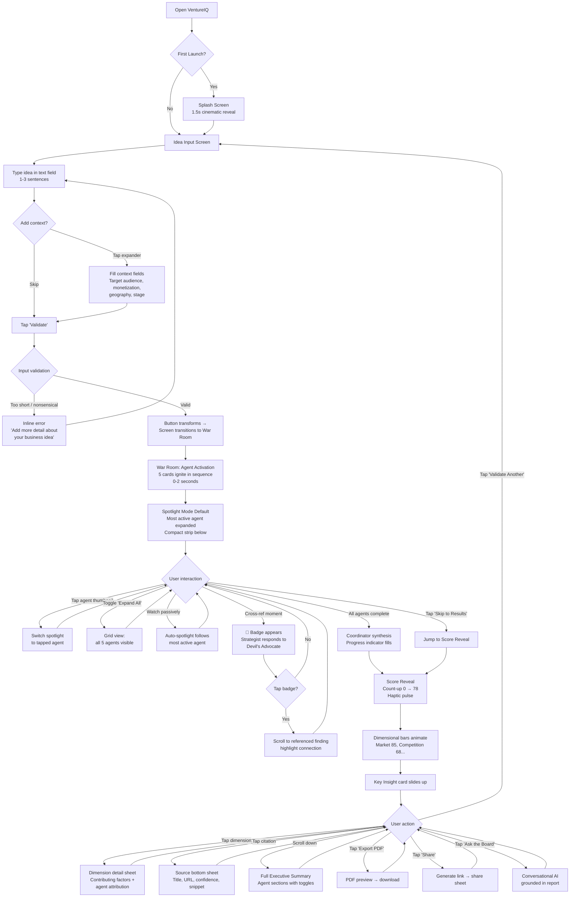
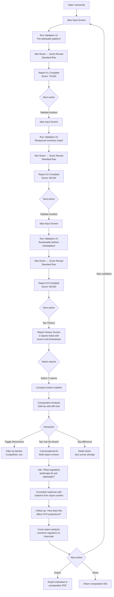
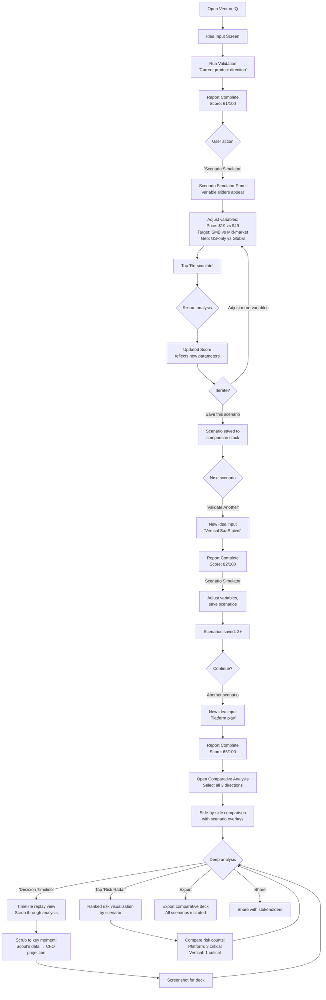

# UX Design Specification — VentureIQ

**Author:** Avishka Gihan
**Date:** 2026-04-14

---

## Executive Summary

### Project Vision

VentureIQ is a real-time, multi-agent decision intelligence platform that transforms a raw business idea into an investor-grade validation brief in under 90 seconds. Five specialized AI agents — Scout, Rival, CFO, Devil's Advocate, and Strategist — operate in parallel within a cinematic War Room, streaming their reasoning live while cross-referencing each other's outputs. The result is an explainable Viability Score backed by confidence ratings and source citations.

The UX vision centers on the **Confidence Stack** — three interlocking patterns that no competitor offers:
- **Visibility** — real-time reasoning via the War Room transforms "loading time" into "engagement time"
- **Verifiability** — every claim carries a confidence score and clickable source citation (the Trust Layer)
- **Multi-perspective reasoning** — cross-agent intelligence is visible to the user, demonstrating analytical depth that single-LLM tools cannot replicate

The product is delivered as a Flutter mobile app (iOS & Android) backed by a FastAPI/LangGraph backend, with 12 screens shipping in V1 as a unified system. The aesthetic direction is cinematic, dark, premium — positioning VentureIQ as serious decision intelligence technology, not a chatbot or simple AI tool.

### Target Users

**Maya — The First-Time Founder (Primary)**
Age 28, product designer validating an idea before quitting her job. Needs to go from "I think this might work" to evidence-backed confidence in 90 seconds. Interaction style: emotional, exploratory, seeking reassurance through data. Values the cinematic War Room experience and shareable PDF exports for co-founder conversations.

**Daniel — The Freelance Consultant (Primary)**
Age 35, one-person strategy consultancy producing client-facing research briefs. Currently spends 15-20 hours per client report at $3,000. Needs efficiency and credibility — the output must be polished enough to present directly to paying clients. Interaction style: professional, efficiency-driven, quality-focused. Values Comparative Analysis, Ask the Board, and multi-report workflows.

**Priya — The Product Manager (Primary)**
Age 31, senior PM at a Series B startup evaluating pivot directions. Needs structured, evidence-backed comparison to replace weeks of subjective stakeholder debate. Interaction style: analytical, comparison-oriented, stakeholder-facing. Values Scenario Simulator, Decision Timeline, and Comparative Analysis.

**Alex — The Platform Operator (Secondary)**
Developer monitoring production health — execution traces, cost-per-report, error rates, cache performance. Interaction style: technical, monitoring-oriented. Primarily uses observability dashboards (LangSmith/Prometheus) rather than the consumer-facing app.

### Key Design Challenges

1. **Information Density vs. Cognitive Overload** — Five simultaneous agent streams, cross-referencing, confidence scores, and multi-dimensional scoring create enormous information density. The War Room must feel thrilling, not overwhelming. Progressive disclosure is critical: summary by default, expandable depth on demand.

2. **Mobile-First Real-Time Streaming** — Token-by-token WebSocket streaming on mobile requires radical information density decisions for 6" screens. The experience must remain legible, beautiful, and performant over cellular networks with potential interruptions (backgrounding, reconnection).

3. **Trust as a UX Pattern** — The Trust Layer must feel trustworthy at a visceral level — not just "we show sources." Visual confidence indicators, citation affordances, and verified/unverified states must communicate authority. The output must be polished enough for Maya to share with a co-founder and Daniel to present to a $3,000 client.

4. **Three User Mindsets, One App** — Maya (emotional/exploratory), Daniel (professional/efficient), and Priya (analytical/comparative) require different interaction patterns. The UX must flex across mindsets without mode-switching or configuration.

5. **The 90-Second Experience** — The War Room transforms loading into engagement, but some users will want to skip ahead. The UX needs both the cinematic experience and a fast-forward path without making either feel second-class.

### Design Opportunities

1. **"Cinematic Intelligence" as Category-Defining UX** — No AI product treats processing as a spectator experience. War Room animations, typography, and real-time choreography can set a new standard that carries virally through screenshots and demos.

2. **Decision Timeline as Novel Interaction** — Scrubbing through multi-agent reasoning is unprecedented. This becomes the "show your work" feature that builds trust and differentiates in portfolios, demos, and investor conversations.

3. **Trust Layer as Visual Brand Identity** — Confidence scores and source citations can become VentureIQ's visual signature — color-coded confidence, animated verification badges, citation ribbons that make trust beautiful rather than clinical.

4. **Dark Premium Aesthetic as Market Signal** — Cinematic, authoritative dark theme positions VentureIQ as serious technology. The aesthetic itself communicates sophistication and separates it from toy-like AI tools.

5. **Agent Personalities as Engagement Hooks** — Each agent's distinct role (Scout 🔍, Rival ⚔️, CFO 💰, Devil's Advocate ⚠️, Strategist 🎯) can be designed with visual identities, animation styles, and streaming "personality" — creating memorable characters users refer to by name.

## Core User Experience

### Defining Experience

The core interaction loop is: **Submit an idea → Watch agents analyze in real time → Receive a trusted, actionable report.** The War Room is the defining experience — the moment where VentureIQ proves it's not another chatbot. If the War Room captivates, users explore every other feature. If it doesn't, nothing else matters.

The core promise collapses into one sentence: *"Type your idea. Watch five AI agents analyze it in real time. Walk away with an investor-grade brief."*

Three interactions must be flawless:
- **Submit** — zero friction from "I have an idea" to "agents are working." No signup walls, no mandatory fields.
- **Watch** — the War Room must be riveting. 90 seconds of loading must feel like 90 seconds of entertainment.
- **Trust** — the Viability Score and Evidence Panel must feel credible enough to stake decisions on, share with co-founders, and present to clients.

### Platform Strategy

**Primary:** Flutter mobile app (iOS 15+ & Android 10+), single codebase, touch-first design.

**Platform capabilities leveraged:**
- Microphone for voice input (optional, requested on use)
- Push notifications for report completion during backgrounding
- Haptic feedback for key moments (score reveal, agent completion, cross-reference triggers)
- Deep linking for shareable report URLs (open in-app or browser fallback)

**Offline:** Cached reports viewable offline via Hive/SQLite; all AI processing requires internet.

**Key constraint:** The War Room — 5 concurrent agent streams — must be designed for a 6" mobile screen. This is the product's hardest UX problem.

**Future extension:** Client-agnostic API backend supports web client addition without backend changes.

### Effortless Interactions

1. **Zero-Friction Idea Submission** — one sentence, one tap. Context fields are optional enhancements, not gates. Anonymous users get 3 free reports without account creation.
2. **Self-Explanatory War Room** — no onboarding tooltips needed. Agent cards, status indicators, and streaming text are visually self-evident.
3. **One-Tap Trust Verification** — every cited claim is tappable inline. One tap reveals source preview with confidence score. No hunting, no navigation.
4. **Fluid Report Navigation** — War Room completion flows seamlessly into Executive Summary → Evidence Panel → agent details. Feels like scrolling a beautifully designed document, not navigating a menu hierarchy.
5. **Instant Export** — one tap for PDF, one tap for shareable link. No configuration dialogs. Defaults are investor-grade.

### Critical Success Moments

1. **"The Agents Are Alive" (0-5s)** — War Room activates, agent cards pulse, first token streams within 1 second. User realizes this is a command center, not a chatbot. If the first 5 seconds don't create a "whoa" reaction, the portfolio mission fails.
2. **"They're Talking to Each Other" (~30-60s)** — cross-referencing pass begins. User sees Strategist react to Devil's Advocate findings in real time. This is the "aha!" moment proving multi-agent intelligence. If cross-referencing isn't visually obvious and emotionally impactful, VentureIQ is just "5 ChatGPT windows."
3. **"I Can Verify This Myself" (Report)** — user taps a bold claim, sees original source with confidence score. Trust is earned, not claimed. This converts AI-skeptic users into advocates.
4. **"This Would've Taken Me Weeks" (Export)** — polished PDF export creates the conversion moment from "interesting" to "indispensable." If the export looks like a data dump, the magic dies.

**Make-or-break flow:** First-time submission → War Room → Score reveal. If this doesn't captivate, no user reaches Scenario Simulator, Comparative Analysis, or Ask the Board.

### Experience Principles

1. **🎬 Spectacle Over Speed** — the 90-second window is a show to choreograph, not a delay to minimize. The War Room isn't loading; it's performing.
2. **🔍 Trust Is Earned, Not Claimed** — never say "our AI is accurate." Make every claim verifiable with one tap. If it can't be cited, flag it transparently.
3. **✨ Complexity Beneath Simplicity** — five agents, cross-referencing, multi-dimensional scoring are enormously complex. The UX should feel effortless. Progressive disclosure: clean surfaces with depth underneath.
4. **📱 Mobile-Native, Not Mobile-Adapted** — every interaction designed for thumb-reach, swipe navigation, 6" viewport. The War Room on mobile should feel better than desktop — intimate, focused, immersive.
5. **🏆 Every Output Is Shareable** — every view should look stunning in isolation because it will be shared in isolation. If a user can't proudly share a screenshot, PDF, or link, the design has failed.

## Desired Emotional Response

### Primary Emotional Goals

**1. Awe → "This is unlike anything I've seen"**
The War Room should trigger the same feeling as watching a mission control room operate — sophisticated technology working in visible concert. This isn't the mild satisfaction of a good tool; it's the visceral thrill of witnessing something operating at a level you didn't think was possible in a consumer product.

**2. Confidence → "I can make this decision now"**
Maya walked in with doubt ("will my idea work?") and walks out with conviction. Daniel feels comfortable putting this in front of a $3,000 client. Priya presents to her CEO and gets a decision in 15 minutes. The Trust Layer doesn't just provide data — it provides the *emotional permission* to act on it.

**3. Empowerment → "I just did something that used to take weeks"**
The moment of export — when the user realizes they just produced $10K-quality research in 90 seconds — should feel like a superpower. Not "the AI is smart" but "I am powerful because I have this."

### Emotional Journey Mapping

| Stage | Emotion | How It Feels | Design Implication |
|:--|:--|:--|:--|
| **Discovery / First Open** | Intrigue + Anticipation | "This looks serious. This looks different." | Dark premium aesthetic, zero clutter, no playful/cartoon elements. The app looks like Bloomberg Terminal meets Apple — authoritative and polished. |
| **Idea Input** | Ease + Momentum | "That was easy. Let's see what happens." | Minimal friction, generous input field, optional context fields feel expansive not restrictive. One tap to launch. |
| **War Room Activation (0-5s)** | Awe + Excitement | "Whoa — the agents are alive." | Cinematic animation, agent cards ignite in sequence, pulsing status indicators, dramatic audio-visual orchestration. |
| **Agent Streaming (5-30s)** | Fascination + Engagement | "I can't look away." | Token-by-token streaming with typing simulation, each agent with distinct visual personality, real-time search results appearing. |
| **Cross-Referencing (30-60s)** | Amazement + Trust | "They're actually talking to each other. This is real intelligence." | Visual connections between agents, highlight animations when one agent references another, "influence lines" or badge notifications. |
| **Score Reveal** | Anticipation → Clarity | "Okay, here's the verdict." | Dramatic score reveal animation (count-up or unveil), radar chart filling in dimension by dimension, haptic pulse. |
| **Evidence Panel** | Trust + Verification | "I don't have to take their word for it." | Clean citation cards, one-tap source previews, confidence badges that feel authoritative (not gamified). |
| **Deep Exploration** | Control + Mastery | "I can go as deep as I want." | Scenario sliders feel responsive, Decision Timeline scrubbing feels like power, Ask the Board feels like consulting a panel of experts. |
| **Export/Share** | Pride + Accomplishment | "I can't believe I just produced this." | Polished PDF preview, one-tap share, the output looks premium enough to be proud of sending. |
| **Return Visit** | Familiarity + Anticipation | "I know exactly what to do, and I'm excited to do it again." | Report history feels like an asset library, Ask the Board remembers context, new ideas feel inviting. |
| **Error / Failure** | Understanding + Patience | "Something went wrong but I know what to do." | Clear, calm error states. Agent failure → graceful degradation with explanation, not cryptic errors. The system feels resilient, not fragile. |

### Micro-Emotions

The make-or-break emotional tensions in VentureIQ:

| Tension | We Want → | We Must Avoid → |
|:--|:--|:--|
| **Confidence vs. Confusion** | User always knows what's happening and what to do next | War Room feels chaotic, too much information with no hierarchy |
| **Trust vs. Skepticism** | Source citations and confidence scores build belief | Claims feel unverifiable, scores feel arbitrary |
| **Excitement vs. Anxiety** | War Room streaming feels thrilling and entertaining | Real-time analysis feels stressful, like watching something that might break |
| **Accomplishment vs. Frustration** | Export feels like completing something valuable | Report feels incomplete, generic, or not polished enough to share |
| **Delight vs. Overwhelm** | Each new feature discovery feels like finding a hidden gem | Too many features visible at once, information overload |
| **Belonging vs. Isolation** | "This tool was built for someone like me" | "This is for technical people / this is too simple for my needs" |

**Most critical tension:** Trust vs. Skepticism. If the user doesn't trust the output, every other emotion is irrelevant. The Trust Layer is the emotional foundation the entire product rests on.

### Design Implications

| Target Emotion | UX Design Approach |
|:--|:--|
| **Awe** | Cinematic War Room choreography — staggered agent activation, glow effects, ambient particle animations, dramatic score reveal with count-up animation and haptic feedback |
| **Confidence** | Trust Layer visibility everywhere — confidence badges, source citation cards, "verified" vs "estimated" labels. Viability Score presented with methodology transparency. |
| **Empowerment** | Export quality. The PDF must look like it came from McKinsey, not a chatbot. Shareable links render beautifully. The user feels like they have a senior analyst on retainer. |
| **Fascination** | Agent personalities with distinct streaming cadences, visual identities, and "thinking" states. Cross-referencing animations that show influence flowing between agents. |
| **Trust** | Nothing hidden, nothing forced. "Show your work" philosophy. Decision Timeline lets you inspect the entire reasoning chain. Unverified claims are transparently flagged, not hidden. |
| **Control** | Scenario Simulator sliders respond instantly. Navigation is fluid and non-linear — jump to any section, return to War Room replay, compare any reports. The user is never trapped. |
| **Calm (in errors)** | Graceful degradation is visible and explained: "4 of 5 agents completed. Confidence adjusted." Not "Something went wrong." Agent failures become *trustworthy* because the system is honest about them. |

### Emotional Design Principles

1. **🎭 Design for "Tell-a-Friend" Moments** — every interaction should create something the user wants to show someone. The War Room is screenshot-worthy. The PDF is share-worthy. The Viability Score is conversation-worthy.

2. **🔒 Trust Is the Emotional Foundation** — confidence scores, citations, and transparency aren't features; they're the emotional infrastructure. Build trust first, delight second. A beautiful product nobody trusts is worthless.

3. **⚡ Choreograph Time, Don't Fight It** — the 90-second analysis is a dramatic arc (activation → analysis → cross-referencing → synthesis → reveal). Design it like a story with rising action, climax, and resolution. The user should feel like 90 seconds was the *perfect* amount of time.

4. **🛡️ Make Failure Feel Safe** — errors, partial results, and degraded outputs should feel like the system being *honest*, not the system being *broken*. A 4-of-5 completion with adjusted confidence is more trustworthy than a 5-of-5 that hides a failure.

5. **👑 The User Is the Hero, Not the AI** — the agents are the user's team, not the show. The user made a smart decision by using VentureIQ. The output is *their* research brief, produced with *their* AI team. The emotional frame: empowerment, not dependence.

## UX Pattern Analysis & Inspiration

### Inspiring Products Analysis

**1. ChatGPT — The Streaming Interaction Benchmark**

| Dimension | What They Nail | VentureIQ Relevance |
|:--|:--|:--|
| **Streaming UX** | Token-by-token text streaming feels alive and conversational. The response builds in front of you. | War Room streaming must feel at least this smooth, but with 5 parallel streams instead of 1. ChatGPT proved streaming is engagement. |
| **Input Simplicity** | One text field. Type and press enter. No configuration blocking the core action. | Idea Input should feel this simple — one field, one tap. Context fields are expansions, not gates. |
| **Conversation Flow** | Each response naturally invites a follow-up. The interface is a conversation, not a form → result pattern. | Ask the Board must feel this conversational — grounded in the report but naturally inviting deeper questions. |
| **Progressive Complexity** | Simple by default, but power users discover system prompts, custom instructions, plugins. | VentureIQ should work beautifully for Maya (just submit) but reveal depth for Priya (scenarios, timelines). |

**Key lesson:** ChatGPT makes AI feel *approachable*. VentureIQ needs approachable *and* authoritative — same ease of interaction, wrapped in a premium aesthetic that signals decision intelligence.

**2. Perplexity — The Trust Layer Pioneer**

| Dimension | What They Nail | VentureIQ Relevance |
|:--|:--|:--|
| **Inline Citations** | Every factual claim has a numbered source reference. Verifiable without leaving the flow. | VentureIQ's Trust Layer must exceed this — not just numbered references, but confidence scores on every citation. |
| **Source Panel** | Structured source cards with title, URL, and snippet. Clean, scannable, authoritative. | Evidence Panel should take direct inspiration — clean cards, one-tap previews, organized by agent. |
| **Answer + Sources = One Unit** | Answer and sources are integrated, not separate screens. Trust is built in the reading flow. | Reports should embed trust signals inline, then provide dedicated Evidence Panel for deep dives. |
| **Query Understanding** | Perplexity reformulates queries, showing it understands what you’re asking. | Plausibility checks should feel helpful — "Here's how I'll analyze your idea" — not rejective. |

**Key lesson:** Perplexity democratized source transparency. VentureIQ adds *multi-perspective* transparency — not just "here are the sources" but "here's how 5 experts interpreted the sources differently."

**3. Notion — The Information Architecture Master**

| Dimension | What They Nail | VentureIQ Relevance |
|:--|:--|:--|
| **Structured Elegance** | Complex hierarchical information feels clean and navigable. Depth without clutter. | Report navigation should feel like browsing a beautifully structured Notion document, not clicking through menus. |
| **Typography & Whitespace** | Generous spacing, clear heading hierarchy, restrained color. Content breathes. | Agent streaming text must use excellent typography — well-typeset report feel, not chat messages. |
| **Blocks as Building Blocks** | Every content piece is a consistent "block" that can be expanded or collapsed. | Report sections follow a card/block metaphor — consistent visual language across content types. |
| **Dark Mode Excellence** | Muted backgrounds, high-contrast text, subtle borders. Nothing glows or screams. | Premium dark ≠ neon glows. Muted backgrounds with strategic pops of color for important elements. |
| **Progressive Disclosure** | Pages reveal depth on click. Toggle blocks hide detail until requested. | War Room → Report uses this — summary by default, expandable depth everywhere. |

**Key lesson:** Notion proved information-dense products can feel calm and elegant. VentureIQ's design system must be even more disciplined about hierarchy, spacing, and progressive disclosure.

### Transferable UX Patterns

**Navigation Patterns:**
- **ChatGPT's conversation list → Notion's sidebar** — Report History as a structured, scannable sidebar or bottom sheet. Each past report is a card with idea title, Viability Score, and date.
- **Perplexity's thread continuity** — Ask the Board maintains conversation continuity. Returning users resume naturally with prior context.

**Interaction Patterns:**
- **ChatGPT's streaming + stop button** — War Room offers a "Skip to Results" affordance, always available, never disruptive.
- **Perplexity's inline source taps** — Source citations tappable inline (numbered superscripts or badges). One tap → source preview card or bottom sheet.
- **Notion's toggle/expand blocks** — Agent cards expand/collapse. Post-report, each agent section is a toggleable block.

**Visual Patterns:**
- **Notion's typography hierarchy** — Clear heading levels with generous spacing. Agent names are H3-weight, key findings are callout blocks.
- **Perplexity's source card design** — Clean cards with title, domain favicon, relevance snippet. VentureIQ adds confidence badges (color-coded: green ≥80%, amber 50-79%, red <50%).
- **ChatGPT's dark mode simplicity** — Dark backgrounds with white text and minimal accent colors. Agent identity colors are the primary color system.

### Anti-Patterns to Avoid

1. **❌ Dashboard Overload (Generic BI Tools)** — VentureIQ's War Room is NOT a dashboard. It's a *narrative experience*. Each agent tells a story; the Viability Score is the conclusion, not one of 47 widgets.

2. **❌ Static AI Output (Wrapper Apps)** — No loading spinner → static document. VentureIQ must feel *alive* — streaming, interactive, explorable. The output is a living analysis.

3. **❌ Gamification of Trust Signals** — Confidence scores should feel *institutional* and *authoritative* (Bloomberg-style), not gamified (Duolingo-style). Color-coded text, not animated trophy icons.

4. **❌ Nested Menu Navigation** — No hamburger → sub-menu → screen patterns. Navigation is flat and fluid — swipe between sections, tap to expand, scroll to explore.

5. **❌ Loading Spinners Hiding Work** — Never show a spinner when you could show agents working. Streaming is the product.

### Design Inspiration Strategy

**What to Adopt Directly:**

| Pattern | Source | Application |
|:--|:--|:--|
| Token streaming with typing simulation | ChatGPT | War Room agent streams |
| Inline numbered source citations | Perplexity | Trust Layer superscript references |
| Toggle/expand content blocks | Notion | Agent analysis sections |
| Dark mode with muted backgrounds | Notion | App-wide dark theme |
| One-field input simplicity | ChatGPT | Idea Input screen |

**What to Adapt:**

| Pattern | Source | Adaptation |
|:--|:--|:--|
| Single-stream response | ChatGPT | → 5 parallel streams with agent identity and orchestrated choreography |
| Flat source list | Perplexity | → Source cards grouped by agent, with confidence scores and verified/unverified badges |
| Static page layout | Notion | → Dynamic, time-based layout (streaming → static post-completion) |
| Conversation history | ChatGPT | → Ask the Board with report-grounded context |
| Search follow-ups | Perplexity | → Scenario Simulator with variable sliders |

**What to Explicitly Avoid:**

| Anti-Pattern | Why |
|:--|:--|
| Dashboard grid layouts | VentureIQ is a narrative, not a monitoring dashboard |
| Gamified trust signals | Confidence must feel institutional, not playful |
| Loading spinners during processing | Streaming is the product — never hide the work |
| Static report outputs | Every section should be interactive and explorable |
| Cluttered multi-widget screens | Mobile-first means radical simplicity with depth on demand |

## Design System Foundation

### Design System Choice

**Material Design 3 — Heavily Themed** is the design system foundation for VentureIQ. Flutter's built-in Material library provides the component infrastructure while a comprehensive custom `ThemeData` transforms the visual identity into VentureIQ's dark, premium, cinematic aesthetic.

This is not "default Material." It is Material as an invisible foundation — providing accessibility, platform conventions, and component architecture — while VentureIQ's design language lives in the theming layer and custom widgets.

### Rationale for Selection

1. **Solo developer efficiency** — Material 3 provides ~80% of needed components (cards, sheets, navigation, inputs, dialogs) out of the box. The remaining 20% are purpose-built custom widgets for VentureIQ-specific elements (War Room cards, confidence badges, radar chart, Decision Timeline).
2. **Premium aesthetic achievability** — Material 3's theming system is powerful enough to create a completely custom look. Apps like Notion and Linear use platform foundations but are unrecognizable as "default" — VentureIQ does the same.
3. **Built-in accessibility** — Touch targets (48x48dp), screen reader semantics, contrast ratios, and dynamic text scaling are provided by default, satisfying accessibility NFRs without manual implementation.
4. **Inspiration alignment** — ChatGPT, Perplexity, and Notion all use heavily themed platform-native components on mobile.

### Implementation Approach

| Layer | Approach |
|:--|:--|
| **Foundation** | Material 3 via Flutter — `ThemeData`, `ColorScheme`, `TextTheme` |
| **Global Theme** | Custom dark `ThemeData` with VentureIQ palette, premium typography, custom component themes |
| **Standard Components** | Material widgets themed to spec — cards, app bars, bottom sheets, text fields, chips, navigation |
| **Custom Components** | Purpose-built: War Room agent cards, streaming text display, confidence badges, radar chart, Decision Timeline, Scenario Simulator sliders, source citation cards |
| **Animation** | Flutter animation framework — staggered agent activation, score reveal, cross-reference highlights |
| **Charting** | `fl_chart` for radar chart and market positioning visualizations |

### Customization Strategy

The customization targets three levels:

**Level 1 — Global Theme Overrides:**
Custom dark `ColorScheme`, typography scale (Inter or Outfit), component shape overrides (16dp radius), elevation replacements (borders + subtle glows instead of shadows).

**Level 2 — Component-Level Theming:**
Every Material component (Card, BottomSheet, AppBar, TextField, Chip, NavigationBar) receives a custom theme matching VentureIQ's premium aesthetic. No component should look like "default Material."

**Level 3 — Custom Widgets:**
Purpose-built widgets for experiences Material doesn't cover: War Room agent cards with streaming state, confidence badge system, radar chart with animated fill, Decision Timeline with scrubbing, source citation cards with inline tap previews.

## Defining Core Experience

### Defining Experience

> ***"Type your idea. Watch five AI experts argue about it in real time. Walk away with a verdict you can trust."***

This is a novel combination of three interactions no competitor has assembled:
1. **The War Room** — a spectator experience of multi-agent intelligence
2. **The Cross-Reference Moment** — when agents react to each other's findings
3. **The Verdict** — an explainable Viability Score backed by verifiable evidence

If the War Room captivates, users explore every other feature. If it doesn't, nothing else matters.

### User Mental Model

**How users currently solve this problem:**

| Current Approach | Mental Model | Pain |
|:--|:--|:--|
| Google research | "I'll piece together information myself" | Hours of fragmented searching, no synthesis, no confidence in completeness |
| ChatGPT / single-LLM | "I'll ask the AI" | One perspective, no sources, "is this hallucinated?" anxiety |
| Paid consultants | "I'll hire an expert" | $5K-$50K, weeks of waiting, still a single perspective |
| AI validators (DimeADozen) | "I'll get a quick score" | Static output, no transparency, feels like a Magic 8-Ball |

**The mental model VentureIQ creates:**
> "I have a **board of advisors** who analyze my idea simultaneously, challenge each other, and deliver a transparent verdict I can verify."

Users don't think "I'm using an AI tool" — they think "I'm consulting my advisory board."

**Confusion mitigation:**
- **5 agents streaming at once:** Visual hierarchy — one agent spotlighted at a time, others as peripheral thumbnails, tap to switch focus.
- **Cross-referencing:** Explicit badges: "📎 Responding to Devil's Advocate" with tappable link to the referenced finding.
- **Viability Score context:** Verbal anchors (e.g., "Strong — Most ideas in this category score 60-75") and dimensional breakdown showing *where* the score comes from.

### Success Criteria

| Criterion | What It Looks Like | How We Measure |
|:--|:--|:--|
| **"This just works"** | User types an idea and sees agents streaming within 1 second. No confusion. | Time-to-first-token <1s, zero-guidance completion rate |
| **"I can't look away"** | User watches the full War Room without skipping. | War Room view duration, skip-to-results rate |
| **"They're talking to each other"** | Cross-referencing is visually obvious. User notices agent reactions. | Cross-reference badge interaction rate |
| **"I trust this"** | User taps at least one source citation to verify. | Source tap rate, Evidence Panel engagement |
| **"This would've taken me weeks"** | User exports or shares the report. Output quality exceeds expectations. | Export rate, share rate, return visit rate |

### Novel UX Patterns

| Pattern Element | Classification | Source Familiarity | VentureIQ Innovation |
|:--|:--|:--|:--|
| Text input → AI processing | **Established** | ChatGPT, Perplexity | Combined with context fields for structured input |
| Token-by-token streaming | **Established** | ChatGPT ubiquitous | Multiplied to 5 parallel streams with orchestration |
| Source citations | **Established** | Perplexity normalized | Enhanced with confidence scores + agent attribution |
| Multi-agent parallel display | **Novel** | No consumer product | War Room — 5 agents visible simultaneously |
| Cross-agent referencing (visible) | **Novel** | Completely unprecedented | Agents react in real time, visually connected |
| Viability Score with radar | **Adapted** | Radar charts exist | Multi-dimensional AI-generated business intelligence |
| Decision Timeline / Replay | **Novel** | No equivalent | Scrubbing through multi-agent reasoning history |

**Teaching strategy for novel patterns:**
- **War Room:** No education needed — streaming text is universally understood. Agent cards with status indicators (🔍 Searching → ⚡ Analyzing → 📎 Cross-referencing → ✅ Complete) make lifecycle legible.
- **Cross-referencing:** Subtle "✨ Agents reviewing each other's findings" state transition. Cross-reference badges (📎) are familiar tappable affordances.
- **Decision Timeline:** Introduced post-report as "See how we got here." Familiar scrubbing gesture (video player metaphor). Discover on demand.

### Experience Mechanics

**Phase 1: INITIATION — "Submit Your Idea"**

| Step | User Action | System Response | Emotional Beat |
|:--|:--|:--|:--|
| Open app | Launch VentureIQ | Dark premium splash → Idea Input with generous text field | Intrigue: "This looks serious" |
| Type idea | Enter 1-3 sentences | Subtle character count, optional "Add context" expander below | Ease: "That was simple" |
| Add context (optional) | Tap expander, fill fields | Fields appear smoothly with helpful placeholders | Control: "I can shape the analysis" |
| Submit | Tap "Validate" | Button transforms, screen transitions to War Room | Anticipation: "Here we go" |

**Phase 2: INTERACTION — "The War Room"**

| Phase | Duration | What User Sees | What User Does | Emotional Beat |
|:--|:--|:--|:--|:--|
| Activation | 0-2s | Five agent cards ignite in sequence. Each shows icon, name, "Initializing..." | Watches the choreography | Awe: "The agents are alive" |
| Parallel Streaming | 2-30s | Agents stream simultaneously. One "spotlighted" (expanded), others compact. | Taps cards to switch focus. Scrolls within expanded agent. | Fascination: "I can't look away" |
| Cross-Referencing | 30-60s | "📎 Agents reviewing findings." Visual connections between cards. Strategist shows: "Pivoting GTM based on Rival's gaps..." | Taps 📎 badges to see references. The "aha!" moment. | Amazement: "They're talking to each other" |
| Synthesis | 60-75s | Coordinator indicator appears. Agent cards compact. Synthesis progress fills. | Watches synthesis. "Skip to results" visible but unobtrusive. | Anticipation: "Here comes the verdict" |
| Score Reveal | 75-90s | Viability Score count-up animation (0 → 78). Radar chart fills dimension by dimension. Haptic pulse. | Absorbs score, reads verbal anchor ("Strong"), examines dimensions. | Clarity: "Now I know" |

**Phase 3: FEEDBACK — "Trust & Verification"**

| Interaction | User Action | System Response | Emotional Beat |
|:--|:--|:--|:--|
| View radar breakdown | Tap any dimension (e.g., "Competition: 68") | Dimension expands: contributing factors, key findings, agent attribution | Understanding: "I see why" |
| Verify a claim | Tap inline citation superscript | Bottom sheet: source card with title, URL, confidence badge, snippet | Trust: "I can verify this" |
| Read agent analysis | Scroll through agent sections | Toggle blocks — summary visible, full analysis expandable | Control: "As deep as I want" |
| Flag concern | Tap low-confidence finding | Evidence Panel highlights claim, shows confidence and source | Safety: "Nothing is hidden" |

**Phase 4: COMPLETION — "Act on It"**

| Interaction | User Action | System Response | Emotional Beat |
|:--|:--|:--|:--|
| Export PDF | Tap "Export PDF" | Polished PDF preview → download. Investor-grade formatting. | Pride: "I produced this" |
| Share link | Tap "Share" | Unique web link, copy to clipboard, share sheet. No account needed to view. | Empowerment: "My co-founder needs this" |
| Ask the Board | Tap "Ask the Board" | Conversational AI opens, grounded in full report context. | Curiosity: "What about regulatory risk?" |
| New idea | Tap "Validate Another" | Returns to Idea Input. Previous report saved in history. | Momentum: "Let me try another" |

## Visual Design Foundation

### Color System

VentureIQ's color system is built on layered dark surfaces with strategic accent colors — a cinematic, premium palette that signals decision intelligence technology, not a consumer chatbot. The approach mirrors Bloomberg Terminal's authoritative darkness and Apple's dark mode depth.

#### Surface System (8 Layers)

Near-black base with progressively lighter elevated surfaces create depth and hierarchy without relying on shadows or borders.

| Token | Hex | Role |
|:--|:--|:--|
| `surface-000` | `#09090B` | App background — near black |
| `surface-050` | `#0F1117` | Card / panel background, War Room bg |
| `surface-100` | `#151823` | Elevated cards, panels |
| `surface-150` | `#1A1E2E` | Active / hover card state |
| `surface-200` | `#222639` | Input fields, wells |
| `surface-250` | `#2A2F45` | Borders, dividers (elevated) |
| `surface-300` | `#343A52` | Subtle borders |
| `surface-400` | `#4A5173` | Muted icons, dividers |

#### Brand Accents

| Color | Hex | Role | Semantic Meaning |
|:--|:--|:--|:--|
| Electric Violet | `#6C5CE7` | Primary brand, CTAs, active states | Sophistication + intelligence |
| Violet Hover | `#7E70F0` | Hover / focus state | Interactive feedback |
| Cyan | `#00D2FF` | Data, streaming indicators, charts | Real-time activity, technological precision |
| Synthesis Violet | `#A78BFA` | Coordinator, cross-reference badges | Synthesis, orchestration |

Each accent has a **muted variant** (12-15% opacity) for background tints and a **glow variant** (25-30% opacity) for focus/hover effects.

#### Agent Identity Colors

Each agent has a semantically mapped, immediately recognizable color — designed for instant visual identification in the War Room's multi-stream environment.

| Agent | Color Name | Hex | Semantic Mapping |
|:--|:--|:--|:--|
| 🔍 Scout | Intelligence Blue | `#3B82F6` | Research, discovery, analytical depth |
| ⚔️ Rival | Competitive Rose | `#F43F5E` | Competitive tension, market urgency |
| 💰 CFO | Financial Amber | `#F59E0B` | Financial modeling, growth, projections |
| ⚠️ Devil's Advocate | Critical Red | `#EF4444` | Risk, challenge, warning signals |
| 🎯 Strategist | Strategic Emerald | `#10B981` | Growth strategy, opportunity, optimism |
| 🧠 Coordinator | Synthesis Violet | `#A78BFA` | Synthesis, orchestration, final verdict |

**Color variants per agent:**
- **Full** — Text, icons, status indicators
- **Muted** (15% opacity) — Background tints for cards, badges
- **Glow** (30% opacity) — Hover effects, active state shadows on War Room cards

#### Confidence & Trust Indicators

Institutional-grade, color-coded confidence system. Uses **color + text label** (never color alone) for accessibility.

| Level | Color Name | Hex | Label Examples |
|:--|:--|:--|:--|
| High (≥80%) | Verified Green | `#22C55E` | "92% — Verified", "85% — High" |
| Mid (50-79%) | Caution Amber | `#F59E0B` | "67% — Moderate", "54% — Estimated" |
| Low (<50%) | Warning Red | `#EF4444` | "38% — Low", "22% — Unverified" |

Confidence badges are rendered as pill-shaped elements: muted background tint + colored text + leading dot indicator. The style is Bloomberg-institutional, not Duolingo-gamified.

**Cross-reference badges:** Purple (`#A78BFA`) pill badges — e.g., "📎 Responding to Devil's Advocate" — indicating inter-agent references. Tappable to navigate to the referenced finding.

#### Text System

| Token | Hex | Role |
|:--|:--|:--|
| `text-primary` | `#F0F1F5` | Primary text — high contrast headings and body |
| `text-secondary` | `#A1A7BE` | Supporting text, descriptions, agent streaming content |
| `text-tertiary` | `#6B7194` | Timestamps, labels, metadata |
| `text-disabled` | `#464D6A` | Inactive / disabled elements |
| `text-inverse` | `#09090B` | Text on light or accent-colored backgrounds |

#### Feedback / Status Colors

| Status | Hex | Usage |
|:--|:--|:--|
| Success | `#22C55E` | Completion states, agent "Complete" status |
| Warning | `#F59E0B` | Caution states, degraded performance |
| Error | `#EF4444` | Failure states, critical errors |
| Info | `#3B82F6` | Informational states, tips |

#### Special Effects

| Effect | Value | Usage |
|:--|:--|:--|
| Primary Glow | `0 0 20px rgba(108, 92, 231, 0.3)` | CTA button hover, focused inputs |
| Score Glow | `0 0 30px rgba(0, 210, 255, 0.25)` | Viability Score reveal radiance |
| Subtle Border | `1px solid rgba(255, 255, 255, 0.06)` | Default card borders |
| Active Border | `1px solid rgba(108, 92, 231, 0.4)` | Focused / active card borders |

### Typography System

**Primary Typeface: Inter** — Geometric precision, excellent legibility at small sizes, optimized for screens. Used by Linear, Vercel, Stripe, and Notion — premium technology products that prioritize information density with visual clarity.

**Monospace: JetBrains Mono** — For data values, cost metrics, token counts, hex codes, and technical metadata. Provides clear distinction between content text and data/metrics.

#### Type Scale

| Level | Size | Weight | Letter Spacing | Usage |
|:--|:--|:--|:--|:--|
| Display | 40px / 2.5rem | 800 (ExtraBold) | -0.03em | Viability Score reveal, hero numbers |
| H1 | 28px / 1.75rem | 700 (Bold) | -0.02em | Screen titles (War Room, Executive Summary) |
| H2 | 22px / 1.375rem | 700 (Bold) | -0.02em | Section headers |
| H3 | 18px / 1.125rem | 600 (SemiBold) | -0.01em | Card titles, agent names |
| Body | 15px / 0.9375rem | 400 (Regular) | 0 | Primary content, agent streaming text |
| Body SM | 13px / 0.8125rem | 400 (Regular) | 0 | Secondary content, citations, source snippets |
| Caption | 12px / 0.75rem | 400 (Regular) | 0 | Labels, timestamps, metadata |
| Micro | 11px / 0.6875rem | 500 (Medium) | 0.02em | Badges, tags, status indicators |

#### Typography Principles

1. **Negative letter-spacing on headings** — `-0.02em` to `-0.03em` creates the premium tightness seen in high-end dashboard UIs
2. **Generous line-height for readability** — `line-height: 1.6` for body text; `1.1–1.2` for display/headings
3. **Anti-aliased rendering** — `-webkit-font-smoothing: antialiased` for crisp, clean text on dark backgrounds
4. **Monospace for data** — All numerical data (costs, tokens, percentages, scores) uses JetBrains Mono to visually separate data from narrative content
5. **Weight as hierarchy** — ExtraBold (800) reserved exclusively for the Viability Score; Bold (700) for section headers; SemiBold (600) for card titles; Regular (400) for body

### Spacing & Layout Foundation

**Base Unit: 4px** — All spacing values are strict multiples of 4px, creating a consistent, harmonious rhythm across all screens.

#### Spacing Scale

| Token | Value | Common Usage |
|:--|:--|:--|
| `space-1` | 4px | Tight element gaps (icon to text) |
| `space-2` | 8px | Inline spacing, badge padding, compact gaps |
| `space-3` | 12px | Compact card padding, tight list items |
| `space-4` | 16px | Default card padding, list gaps, horizontal margins |
| `space-5` | 20px | Section inner padding |
| `space-6` | 24px | Card group spacing, generous card padding |
| `space-7` | 32px | Major section spacing within screens |
| `space-8` | 40px | Screen section breaks |
| `space-9` | 48px | Touch targets (minimum 48dp per Material guidelines) |
| `space-10` | 64px | Major layout breaks, screen-level spacing |

#### Border Radius Scale

| Token | Value | Usage |
|:--|:--|:--|
| `radius-sm` | 8px | Buttons, badges, small interactive elements |
| `radius-md` | 12px | Cards, inputs, panels |
| `radius-lg` | 16px | Elevated panels, War Room agent cards |
| `radius-xl` | 20px | Modal bottom sheets, large containers |
| `radius-full` | 9999px | Pills, confidence badges, status indicators |

#### Layout Principles

1. **Mobile-first vertical stacking** — Single column with full-width cards as default. Horizontal layouts used only where 2 items naturally pair (Viability Score + radar chart, comparison columns in Comparative Analysis)
2. **48dp minimum touch targets** — All interactive elements (buttons, tappable citations, agent card switches) meet Material Design accessibility guidelines
3. **Progressive density** — War Room uses compact padding (12–16px) to maximize information density during the streaming experience; Report view uses generous padding (20–24px) for relaxed reading
4. **Edge-to-edge cards with consistent gutters** — 16px horizontal margins from screen edge; cards span full width within those margins
5. **Content-driven breakpoints** — No rigid grid; layout responds to content type (streaming cards vs. report sections vs. comparison columns)

### Accessibility Considerations

#### Contrast Ratios (WCAG 2.1 AA Compliance)

| Combination | Ratio | Standard | Status |
|:--|:--|:--|:--|
| Primary text (`#F0F1F5`) on `surface-000` (`#09090B`) | 15.8:1 | 4.5:1 required | ✅ Exceeds |
| Secondary text (`#A1A7BE`) on `surface-050` (`#0F1117`) | 7.2:1 | 4.5:1 required | ✅ Passes |
| Tertiary text (`#6B7194`) on `surface-100` (`#151823`) | 4.6:1 | 3:1 for large text | ✅ Passes |
| Agent blue (`#3B82F6`) on `surface-050` | 5.1:1 | 4.5:1 required | ✅ Passes |
| Agent emerald (`#10B981`) on `surface-050` | 6.8:1 | 4.5:1 required | ✅ Passes |
| Agent amber (`#F59E0B`) on `surface-050` | 8.4:1 | 4.5:1 required | ✅ Passes |
| Agent rose (`#F43F5E`) on `surface-050` | 4.8:1 | 4.5:1 required | ✅ Passes |
| Agent red (`#EF4444`) on `surface-050` | 4.6:1 | 3:1 for large text | ✅ Passes |

#### Color Independence

- All confidence indicators use **color + text label** (never color alone) — "92% — Verified", "67% — Moderate", "38% — Low"
- Agent identity conveyed by **color + icon + name** — triple redundancy ensures colorblind users can distinguish agents
- Cross-reference badges include **📎 icon + descriptive text** alongside color

#### Focus & Interaction

- Focus states use a 3px accent ring: `box-shadow: 0 0 0 3px rgba(108, 92, 231, 0.25)` — visible on all interactive elements against dark backgrounds
- Touch targets meet 48×48dp minimum across all interactive elements
- Platform screen reader support (VoiceOver on iOS, TalkBack on Android) via semantic Flutter widget annotations

#### Dynamic Text Scaling

- Layout supports system text scaling up to 1.5× without layout breakage
- Card components reflow vertically when text size increases
- Score Display uses responsive sizing that scales proportionally

### Visual Foundation Reference

A comprehensive interactive HTML reference of the complete color system, typography scale, spacing system, and UI component previews is available at: `_bmad-output/planning-artifacts/ventureiq-visual-foundation.html`

## Design Direction Decision

### Design Directions Explored

Six distinct design directions were generated and evaluated as interactive HTML mockups (`_bmad-output/planning-artifacts/ux-design-directions.html`), each showing War Room, Score Reveal, and Evidence Panel implementations:

| Direction | Concept | War Room Approach | Key Strengths |
|:--|:--|:--|:--|
| ① Command Center | Dense mission-control grid | All 5 agents visible simultaneously in 2x2+1 grid | Maximum information density, all-at-once awareness |
| ② Spotlight Focus | One agent expanded at a time | Large primary card + compact thumbnail strip | Low cognitive load, Apple-like focus |
| ③ Timeline Flow | Vertical chronological feed | Agents stack as timestamped feed entries with spine | Natural scroll, chronological story, strong cross-referencing |
| ④ Tabbed Panels | Tab-based agent switching | Full-screen per agent, horizontal tab bar | Maximum depth per agent, document-like reading |
| ⑤ Card Carousel | Horizontal swipe between agents | Full-width cards with paging dots | Immersive, Stories-like, thumb-friendly |
| ⑥ Hybrid Adaptive | Spotlight + expandable grid | Spotlight default with "Expand All" toggle to grid | Serves all personas, adapts to preference |

### Chosen Direction

**Direction ⑥ Hybrid Adaptive** — with significant elements borrowed from **Direction ③ Timeline Flow** and **Direction ② Spotlight Focus**.

**Final hybrid composition:**

1. **War Room Layout: Hybrid Adaptive + Timeline Spine**
   - **Default state:** Spotlight mode — one agent expanded with rich, readable content. Compact awareness strip showing all 5 agent statuses below.
   - **Power user state:** "Expand All" toggle reveals Command Center 2×2+1 grid with all agents simultaneously.
   - **Timeline integration:** Chronological timestamp spine from Direction ③ used as the connecting metaphor. Each agent's output appears with timestamps (0:12, 0:28, 0:42) showing real-time progression.
   - **System remembers preference:** User's last mode choice (spotlight vs. expanded) persists across sessions.

2. **Score Reveal: Large Cinematic Score + Dimensional Breakdown**
   - **Hero treatment:** 72px score number with cyan→violet gradient, radial glow background effect.
   - **Anchor label:** "Strong Viability" in confidence-green immediately below.
   - **Dimensional bars:** Horizontal bar chart showing all 5 dimensions (Market, Execution, Financials, Risk, Competition) with color-coded fills and mono-font values.
   - **Key Insight card:** Agent-colored left border highlighting the most important strategic recommendation.

3. **Evidence Panel: Structured + Inline Citations with Confidence Badges (Perplexity-style)**
   - **Inline citation superscripts:** Report text contains numbered reference superscripts [1], [2], [3] linking to sources — exactly like Perplexity's approach.
   - **Expandable source cards:** Tapping a superscript reveals source details (title, URL, snippet, confidence badge).
   - **Agent attribution:** Each citation tagged with the agent that cited it ("Cited by 🔍 Scout", "Cited by ⚠️ Devil's Advocate").
   - **Confidence badges on every claim:** Pill-shaped badges (green/amber/red) attached to individual data points, not just sources.
   - **Summary stats:** Header shows "12 sources · 3 agents cited · 78% avg confidence".

### Design Rationale

**Why Hybrid Adaptive as the base:**
- **Serves all three personas simultaneously** — Maya (Curious Explorer) gets the focused Spotlight for her first validation; Daniel (Serial Entrepreneur) and Priya (Technical Founder) toggle to the dense Command Center grid for rapid multi-agent monitoring.
- **Preserves the "agents are alive" moment** — Spotlight mode creates cinematic focus that makes the cross-referencing "aha!" moment (Strategist responding to Devil's Advocate) impossible to miss.
- **Maximizes criteria coverage** — Scores ★★★ on multi-agent awareness, cross-ref visibility, mobile readability, AND cinematic impact simultaneously. No other direction achieves this.
- **Adaptive UX builds mastery** — New users start in Spotlight (low cognitive load), naturally discover the Expand toggle as they gain confidence. The system adapts to their growing expertise.

**Why Timeline spine from Direction ③:**
- **Chronological narrative** — Timestamps create a natural sense of unfolding investigation. Users feel they're watching a live analysis happen, not reading a static report.
- **Cross-reference continuity** — The timeline spine makes inter-agent references visually obvious (Strategist responding to Devil's Advocate at 0:42, triggered by Devil's finding at 0:28).
- **Reusable metaphor** — The same timeline pattern powers the "Decision Timeline" replay feature in the Executive Summary, creating cognitive continuity.

**Why Perplexity-style evidence:**
- **Institutional trust** — Inline citations with confidence badges are the highest-trust pattern in AI UIs. Users can verify any claim at any time without leaving the flow.
- **Granular confidence** — Per-claim badges (not just per-source) let users assess the strength of individual data points within a source.
- **Agent attribution** — Knowing which agent cited which source adds a layer of multi-agent transparency that no single-agent product offers.

### Implementation Approach

**War Room — Phased build:**
1. **Phase 1 (MVP):** Spotlight mode only — single expanded agent card with compact awareness strip. Timeline timestamps on each agent's output.
2. **Phase 2:** Add "Expand All" toggle → Command Center grid view. Persist user preference.
3. **Phase 3:** Auto-spotlight — system automatically focuses on the most active/interesting agent (cross-referencing, critical findings).

**Score Reveal — Animation sequence:**
1. Score number counts from 0→78 over 1.2 seconds (ease-out curve).
2. Anchor label fades in 0.3s after score lands.
3. Dimensional bars animate simultaneously, filling left-to-right over 0.8 seconds.
4. Key Insight card slides up from below with 0.4s delay.

**Evidence Panel — Integration approach:**
1. Report text rendered with numbered superscripts linked to source index.
2. Superscript tap → bottom sheet expands with source details, confidence badge, and agent attribution.
3. Evidence Panel accessible as a dedicated section (scroll below report) or as overlay (tap "Sources" button).
4. Confidence badges rendered as Flutter `Chip` widgets with muted background tints.

**Responsive behavior:**
- Portrait: Single column, Spotlight default, full-width cards
- Landscape (future tablet): Side-by-side score + dimensional breakdown
- All views: 48dp minimum touch targets, 16px horizontal margins

### Design Direction Reference

Interactive HTML mockups of all 6 explored directions are available at: `_bmad-output/planning-artifacts/ux-design-directions.html`

## User Journey Flows

### Journey 1: First-Time Validation (Maya's Path)

The primary success path — a first-time user goes from idea to investor-grade report in 90 seconds.



**Key flow decisions:**
- **Zero-registration start** — first action is typing an idea, not creating an account
- **Input validation** catches nonsensical/too-short input before consuming LLM resources (early stopping per PRD)
- **War Room defaults to Spotlight mode** (low cognitive load for first-timers), with Expand All toggle for returning users
- **Auto-spotlight** follows the most active agent, reducing need for manual interaction
- **"Skip to Results"** always available but unobtrusive — respects both patient and impatient users
- **Cross-reference badges** are tap targets but non-blocking — passive users still see the moment organically
- **Post-report actions** (Export, Share, Ask the Board, Validate Another) all accessible from the same screen — no dead ends

### Journey 2: Multi-Report Comparison (Daniel's Path)

The power user workflow — sequential validation, comparative analysis, and conversational deep dives.



**Key flow decisions:**
- **Sequential validation is frictionless** — "Validate Another" returns to input immediately with clean state
- **History screen** shows all past reports with scores, timestamps, and idea summaries for easy comparison selection
- **Comparative Analysis requires exactly 2 reports** selected (checkbox selection in history list)
- **Ask the Board is context-aware** — grounded in whichever report(s) are currently open. Multi-report context enables cross-report queries
- **Follow-up questions chain naturally** without losing report context — session-persistent conversation

### Journey 3: Scenario Simulation & Pivot Evaluation (Priya's Path)

The advanced analysis workflow — variable manipulation, scenario stacking, and stakeholder-ready output.



**Key flow decisions:**
- **Scenario Simulator is a post-report action** — accessed from the report view, not a separate entry point. Pre-populated with original idea parameters
- **Variable sliders** map to the context fields from input (pricing, target segment, geography, stage)
- **Scenario stacking** — each saved scenario adds to a comparison queue accessible from Comparative Analysis
- **Decision Timeline uses familiar video scrubbing** — shows causal chain between agents (Scout's data → CFO's projection)
- **Risk Radar** aggregates critical/moderate/low risks across scenarios for at-a-glance comparison
- **Export generates a comparative deck** — all scenarios side-by-side in a single PDF for stakeholder presentation

### Journey Patterns

Reusable interaction patterns extracted across all three journeys:

| Pattern | Description | Used In |
|:--|:--|:--|
| **Core Pipeline** | Input → Validate → War Room → Score. Every journey passes through the same 4-phase funnel | All journeys |
| **Spotlight → Detail Sheet** | Tap any data point → bottom sheet with detailed breakdown. Consistent gesture across dimensions, citations, agent sections | Maya, Daniel, Priya |
| **Progressive Disclosure** | Summary first → tap to expand. Works for agent outputs, dimensional scores, individual citations | All journeys |
| **Cross-Reference Navigation** | 📎 badge → tap → scroll to referenced content. Same gesture whether in War Room or Executive Summary | Maya, Priya |
| **Action Bar** | Post-report actions (Export, Share, Ask the Board, Scenario Simulator) always available as a persistent action row below the score | All journeys |
| **History → Compare** | Select 2+ reports from history → trigger Comparative Analysis. Same grid regardless of whether reports were run sequentially or across sessions | Daniel, Priya |
| **Ground-then-Ask** | Ask the Board always grounded in current report context. System cites existing findings rather than generating new uncited claims | Daniel |
| **Scenario Stack** | Save parameter variations as named scenarios → compare across all saved scenarios in Comparative Analysis | Priya |

### Flow Optimization Principles

1. **Zero-registration start** — First action is typing an idea, not creating an account. Authentication deferred until export/share (if required at all for MVP)
2. **2-tap-to-value** — From any screen, the user is at most 2 taps from the information they need. War Room → Tap agent → Detail. Score → Tap dimension → Breakdown
3. **Graceful impatience** — "Skip to Results" is always available during War Room streaming. Users who skip still get the full score and report; they just miss the live streaming experience
4. **Error recovery without restart** — Input validation catches bad input before LLM calls. If an agent fails mid-stream, the system shows a "partial results" state with the remaining agents' output rather than a blank error screen
5. **Context preservation** — Navigating away from a report and returning always restores the exact scroll position, expanded sections, and last-viewed agent
6. **No dead ends** — Every screen has a clear "next action" (Validate Another, Compare, Ask the Board, Export). The user is never left wondering "now what?"
7. **Progressive complexity** — Maya's journey uses only the core pipeline. Daniel adds history + comparison. Priya adds scenarios + timeline. Each persona encounters only the features they need


## Component Strategy

### Design System Components

**Foundation: Material Design 3 (Flutter) — Heavily Themed**

All Material 3 components are themed via `ThemeData` and component-level overrides. Zero components should look like "default Material." The theming layer transforms Material's accessibility, platform conventions, and component architecture into VentureIQ's dark, premium, cinematic aesthetic.

**Themed Material Components:**

| Component | Theming Applied |
|:--|:--|
| **Card** | `surface-050` background, 16dp radius (`radius-lg`), subtle border (`1px solid rgba(255,255,255,0.06)`), no elevation shadow |
| **BottomSheet** | `surface-100`, 20dp radius top corners (`radius-xl`), drag handle |
| **TextField** | `surface-200` fill, Electric Violet focus border + glow (`0 0 20px rgba(108,92,231,0.3)`) |
| **FilledButton** | Electric Violet fill, 8dp radius (`radius-sm`), hover glow, `text-inverse` label |
| **TextButton / IconButton** | `text-secondary` default, Electric Violet hover/focus, no background |
| **Chip / FilterChip** | Muted agent-color backgrounds (15% opacity), `text-primary` labels, `radius-full` |
| **NavigationBar** | `surface-050` background, active item in Electric Violet, 48dp touch targets |
| **TabBar** | Transparent background, Electric Violet active indicator, `text-secondary` inactive labels |
| **ExpansionTile** | `surface-050` collapsed, `surface-100` expanded, agent-colored leading icon |
| **SegmentedButton** | `surface-200` background, Electric Violet active segment, used for Spotlight/Grid toggle |
| **Slider** | Cyan track, Electric Violet thumb — base for ScenarioSlider customization |
| **SnackBar** | `surface-100` background, accent-colored left border (success/warning/error), `text-primary` content |
| **LinearProgressIndicator** | Cyan (`#00D2FF`) active track on `surface-200` background — used for synthesis progress |
| **Dialog / AlertDialog** | `surface-100` background, `radius-xl`, no elevation shadow, subtle border |
| **ListTile** | `surface-050` background, `text-primary` title, `text-secondary` subtitle, 48dp minimum height |
| **Divider** | `surface-250` color, 1px thickness |
| **SearchBar** | `surface-200` fill, `text-tertiary` placeholder, Electric Violet focus |

### Custom Components

VentureIQ requires 15 custom components for experiences that Material Design 3 does not cover — purpose-built widgets that form the product's distinctive interaction layer.

#### WarRoomAgentCard

**Purpose:** The primary War Room element — displays a single agent's live streaming analysis with identity, status, and interactive content. This is the product's most important custom widget.

**Content:**
- Agent icon + name + color identity (e.g., 🔍 Scout — Intelligence Blue `#3B82F6`)
- AgentStatusIndicator showing current lifecycle phase
- StreamingTextDisplay for token-by-token content
- Timestamp markers at content intervals (0:12, 0:28...)
- CrossReferenceBadge elements when triggered during cross-referencing phase
- Search result snippets (during "searching" phase)

**States:**

| State | Visual Treatment |
|:--|:--|
| `initializing` | Card appears with agent color glow border, pulsing dot, "Initializing..." label |
| `searching` | Search icon animates, search query terms stream in `text-secondary` |
| `analyzing` | StreamingTextDisplay active, text streams token-by-token with cursor |
| `cross_referencing` | Synthesis Violet highlight border, 📎 CrossReferenceBadge appears, referencing text streams |
| `complete` | ✅ status badge, full content static, card compactable via tap |
| `error` | Amber/red border, graceful error message, "Partial results available" label |

**Variants:**
- **Expanded (Spotlight)** — full-width, multi-line scrollable content, rich detail. Used when agent is the spotlight focus in Hybrid Adaptive default mode.
- **Compact (Awareness Strip)** — minimal: icon + name + status badge + single-line preview. 64dp height. Used in the thumbnail strip below the spotlight.
- **Grid (Command Center)** — 2×2+1 layout cards, medium information density, independently scrollable within cell. Used in "Expand All" grid view.

**Accessibility:**
- Semantic label: "Agent [name], status: [status], [content preview]"
- Focus traversal: Tab through agents in strip order (Scout → Rival → CFO → Devil's Advocate → Strategist)
- Status changes announced via live region
- 48dp minimum touch targets on all interactive elements within card

---

#### StreamingTextDisplay

**Purpose:** Renders token-by-token text with typing simulation, providing the "agents are alive" visual experience. Used within WarRoomAgentCard and as standalone in report views.

**Content:**
- Incoming text tokens rendered with configurable cadence (~30ms per token for natural reading rhythm)
- Inline InlineCitationSuperscript elements `[1]` `[2]` rendered as tappable references
- CrossReferenceBadge elements rendered inline within text flow
- Blinking cursor (Cyan `#00D2FF`) at stream end during active streaming
- Text styled in Body typography (15px Inter Regular, `text-secondary` during streaming, `text-primary` when complete)

**States:**

| State | Visual |
|:--|:--|
| `streaming` | Text appending with blinking cursor, smooth auto-scroll to bottom |
| `paused` | Cursor static, "Resuming..." label if connection interrupted |
| `complete` | Cursor removed, full text static at `text-primary`, all citations interactive |

**Interaction Behavior:**
- Auto-scrolls to latest content during streaming; user scroll-up pauses auto-scroll (resumable)
- Tapping InlineCitationSuperscript triggers SourceCitationCard as bottom sheet
- Long-press on text enables copy to clipboard
- Text respects system dynamic text scaling (up to 1.5×)

**Accessibility:**
- Live region announces new content in batched chunks (~2 sentences), not per-token
- Citations announced as "Source [number], tap to view"

---

#### CrossReferenceBadge

**Purpose:** Tappable inline badge indicating an agent is responding to or referencing another agent's findings — the visual representation of the cross-referencing "aha!" moment.

**Content:** `📎 Responding to [Agent Name]` — pill-shaped (`radius-full`), Synthesis Violet (`#A78BFA`) background at 15% opacity, Synthesis Violet text.

**States:**
- `default` — muted purple pill with text, subtle border
- `tapped` — highlighted border at 40% opacity, navigates to referenced finding
- `highlight` — animated pulse (0.3s) when cross-reference first appears in stream — draws attention to the critical moment

**Variants:**
- **Inline** — within StreamingTextDisplay text flow, wraps between words
- **Card Header** — attached to top of WarRoomAgentCard during `cross_referencing` state, full-width

**Accessibility:** "Cross-reference: [Agent] is responding to [Referenced Agent]'s finding. Tap to navigate to referenced content."

---

#### ConfidenceBadge

**Purpose:** Institutional-grade confidence indicator attached to claims, sources, and data points throughout the Trust Layer. Uses color + text label (never color alone) for accessibility compliance.

**Content:** `[●] [percentage]% — [label]` — pill-shaped (`radius-full`), muted background tint + colored text + leading dot indicator.

**States:**

| Level | Color | Hex | Background Tint | Label Examples |
|:--|:--|:--|:--|:--|
| High (≥80%) | Verified Green | `#22C55E` | 15% opacity green | "92% — Verified", "85% — High" |
| Mid (50-79%) | Caution Amber | `#F59E0B` | 15% opacity amber | "67% — Moderate", "54% — Estimated" |
| Low (<50%) | Warning Red | `#EF4444` | 15% opacity red | "38% — Low", "22% — Unverified" |

**Variants:**
- **Pill** — full badge: `[●] 92% — Verified` — used in Evidence Panel source cards and standalone claim verification
- **Compact** — dot + percentage only: `● 92%` — used inline in report text where space is constrained
- **Large** — larger font (Body size), used in Viability Score dimension breakdown details

**Accessibility:** "[percentage] percent confidence, [label]" — color is never the sole indicator; label provides redundant semantic information.

---

#### ViabilityScoreDisplay

**Purpose:** The cinematic hero element for the score reveal moment — large animated score number with gradient, glow, and verbal anchor label. This is the emotional climax of every validation.

**Content:**
- Score number (0–100) in Display typography (40px, ExtraBold 800, Inter)
- Cyan→Violet text gradient (`#00D2FF` → `#6C5CE7`)
- Radial glow background effect: `0 0 30px rgba(0, 210, 255, 0.25)`
- Anchor label below score: verbal interpretation in confidence-colored text
- `/100` suffix in `text-tertiary`

**Anchor Labels:**

| Score Range | Label | Color |
|:--|:--|:--|
| 80-100 | "Strong Viability" | Verified Green `#22C55E` |
| 60-79 | "Promising — With Caveats" | Caution Amber `#F59E0B` |
| 40-59 | "Needs Work" | Warning Red `#EF4444` |
| 0-39 | "High Risk" | Warning Red `#EF4444` |

**States:**

| State | Animation |
|:--|:--|
| `revealing` | Score counts from 0→final over 1.2s (ease-out curve). Glow intensifies during count. Haptic pulse on landing. |
| `static` | Final score displayed, subtle ambient glow |
| `comparison` | Side-by-side, smaller variant, no animation, no glow |

**Variants:**
- **Hero** — 72px score, centered, used in Score Reveal moment on War Room completion
- **Card** — 28px score, used in ReportHistoryCard and Comparative Analysis
- **Inline** — 15px score, no glow, used in text references

**Accessibility:** "[Score] out of 100, [anchor label] viability"

---

#### DimensionalBreakdownBar

**Purpose:** Horizontal progress-style bars showing individual dimension scores (Market, Competition, Financials, Risk, Execution) with color-coded fills and monospace values.

**Content:**
- Dimension label (Inter SemiBold 600, `text-primary`)
- Horizontal fill bar on `surface-200` track, dimension-appropriate color
- Score value in JetBrains Mono (`text-primary`)
- Tappable — expands to dimension detail bottom sheet

**Dimension Colors:**

| Dimension | Color | Hex |
|:--|:--|:--|
| Market | Intelligence Blue | `#3B82F6` |
| Competition | Competitive Rose | `#F43F5E` |
| Financials | Financial Amber | `#F59E0B` |
| Risk | Critical Red | `#EF4444` |
| Execution | Strategic Emerald | `#10B981` |

**States:**
- `animating` — bars fill left-to-right over 0.8s simultaneously (staggered 0.1s per bar)
- `static` — bars filled, tappable for dimension detail
- `highlighted` — one bar visually emphasized (brighter fill, subtle glow) when user taps/focuses

**Accessibility:** "[Dimension]: [score] out of 100. Tap for detailed breakdown."

---

#### RadarChart

**Purpose:** 5-axis radar/spider chart visualizing the Viability Score dimensional breakdown — the signature visual element of the Executive Summary.

**Implementation:** Custom painter using `fl_chart` package or Flutter `CustomPaint` with `Path` rendering.

**Content:**
- 5 axes: Market, Competition, Financials, Risk, Execution
- Filled polygon with Electric Violet fill (20% opacity) and 2px solid Electric Violet border
- Axis labels at each vertex (Inter SemiBold, `text-secondary`)
- Concentric grid polygons at 25/50/75/100 levels (`surface-250` stroke)
- Score values at each vertex in JetBrains Mono (Caption size)

**States:**
- `animating` — polygon vertices animate from center outward, dimension-by-dimension over 1.0s
- `static` — full chart displayed, vertices tappable for dimension details
- `comparison` — two overlaid polygons in different colors (Electric Violet + Cyan) for Comparative Analysis

**Sizing:**
- Default: 280×280dp centered in available width
- Responsive: scales proportionally within container, minimum 200×200dp

**Accessibility:** Text-based alternative provided for screen readers: "Viability Score breakdown — Market: 85, Competition: 68, Financials: 79, Risk: 72, Execution: 74"

---

#### SourceCitationCard

**Purpose:** Expandable card displaying source details when a citation is tapped — the Trust Layer's primary verification interface.

**Content:**
- Source title (Inter SemiBold, `text-primary`, tappable to open URL)
- Domain/URL with favicon (Body SM, `text-secondary`)
- ConfidenceBadge (Pill variant)
- Relevant snippet/excerpt (Body SM, `text-secondary`, max 3 lines with expand)
- Agent attribution: "Cited by 🔍 Scout" — agent icon + name in agent color
- Access timestamp (Caption, `text-tertiary`)

**States:**
- `collapsed` — title + ConfidenceBadge + agent attribution only (in Evidence Panel list view)
- `expanded` — full card with all fields visible (in Evidence Panel, toggled by tap)
- `bottom_sheet` — full details presented as modal bottom sheet when tapped from InlineCitationSuperscript in report text

**Visual Treatment:**
- `surface-100` background, `radius-md` (12dp), subtle border
- 4dp left border in citing agent's identity color

**Accessibility:** "Source: [title], confidence [percentage] percent, cited by [agent name]. Tap to open original source."

---

#### InlineCitationSuperscript

**Purpose:** Numbered inline references `[1]` `[2]` within report text that link to source evidence — the Perplexity-inspired trust pattern.

**Content:** Small superscript number in Electric Violet, enclosed in light brackets, positioned as superscript inline with body text.

**Visual:** Micro typography (11px, Medium 500), Electric Violet (`#6C5CE7`), subtle muted background (Electric Violet at 10% opacity), `radius-sm`.

**Interaction:** Tap → SourceCitationCard opens as modal bottom sheet with source details.

**Accessibility:** "Citation [number], tap to view source"

---

#### AgentStatusIndicator

**Purpose:** Multi-phase lifecycle indicator showing an agent's current processing state — provides at-a-glance awareness of where each agent is in the analysis pipeline.

**Content:** Phase-appropriate icon + status text label, colored by phase:

| Phase | Icon | Text | Color |
|:--|:--|:--|:--|
| Started | ⚡ | "Starting..." | Agent color (muted, 50% opacity) |
| Searching | 🔍 | "Searching..." | Agent color |
| Analyzing | 📊 | "Analyzing..." | Agent color |
| Cross-referencing | 📎 | "Cross-referencing..." | Synthesis Violet `#A78BFA` |
| Complete | ✅ | "Complete" | Success Green `#22C55E` |
| Error | ⚠️ | "Partial results" | Warning Amber `#F59E0B` |

**Variants:**
- **Badge** — icon + short label, compact. Used in WarRoomAgentCard compact variant.
- **Full** — icon + verbose label + timestamp + duration. Used in DecisionTimeline event markers.
- **Dot** — colored dot only, no text. Used in minimal space contexts (navigation badges).

**Accessibility:** "Agent [name] status: [phase]"

---

#### DecisionTimeline

**Purpose:** Scrubbing timeline for replaying multi-agent reasoning — a novel UX innovation that shows the causal chain between agents using a familiar video-player scrubbing metaphor.

**Content:**
- Horizontal timeline track (`surface-200` background, `radius-full`)
- Agent-colored event markers positioned chronologically on track
- Draggable scrubber thumb (Electric Violet, 24dp diameter)
- Event detail panel below timeline: shows what was happening at current position
- Causal connection lines between related events (e.g., Scout finding → CFO projection adjustment)
- Timestamp labels at regular intervals (every 15s)
- Playback controls: play/pause, speed selector (1×, 2×)

**States:**
- `playing` — auto-advances through events, detail panel updates, event markers glow as passed
- `scrubbing` — user drags thumb manually, detail panel updates in real time, markers highlight on hover
- `paused` — static at current position, detail panel shows full event context
- `loading` — timeline populating from event data, skeleton animation

**Event Detail Panel Content:**
- Agent icon + name + status at this point in time
- Content being generated at this moment (text snippet)
- Causal reference if applicable: "This was triggered by [Agent]'s finding: [quote]"

**Sizing:** Full-width, timeline track 48dp height (meets touch target), detail panel flexible below.

**Accessibility:** "Decision timeline at [time]. [Agent] was [action]. Swipe left or right to scrub. Double-tap to play or pause."

---

#### ScenarioSlider

**Purpose:** Enhanced variable adjustment slider for the Scenario Simulator with labels, current value display, tick marks, and score impact preview.

**Content:**
- Variable label (Inter SemiBold, `text-primary`) — e.g., "Pricing Strategy"
- Current value display (JetBrains Mono, `text-primary`) — e.g., "$29/mo"
- Slider track (Cyan `#00D2FF` active, `surface-200` inactive)
- Value tick marks with labels (e.g., $19 / $29 / $49)
- Delta indicator: `↑ +4` or `↓ -6` showing projected score impact (Success Green for positive, Warning Red for negative)
- Original value marker on track (muted indicator)

**States:**
- `default` — slider at original parameter value, no delta shown
- `modified` — slider at new value, delta indicator visible, track color shifts subtly
- `processing` — slider locked (disabled), "Recalculating..." label, spinner on delta
- `error` — slider unlocked, error toast if recalculation failed

**Accessibility:** "[Variable]: current value [value]. Original value [original]. Projected score change: [delta]. Adjust with swipe gesture."

---

#### ReportHistoryCard

**Purpose:** Card displaying a past report in the history list — designed for quick scanning, tapping to view, and selecting for Comparative Analysis.

**Content:**
- Idea title/summary (Inter SemiBold, `text-primary`, truncated to 2 lines)
- ViabilityScoreDisplay (Card variant) — right-aligned
- Date/time generated (Caption, `text-tertiary`)
- Agent completion status: "5/5 agents" or "4/5 agents" with appropriate ConfidenceBadge
- Selection checkbox (for Comparative Analysis multi-select)

**States:**
- `default` — standard card in scrollable list
- `selected` — Electric Violet border (`active border`), checkbox checked, subtle violet background tint
- `comparing` — dimmed (reduced opacity) if not part of current comparison selection

**Visual:** `surface-050` background, `radius-md`, 48dp minimum height, 16dp horizontal padding.

**Accessibility:** "Report: [idea title]. Score: [score] out of 100. Generated [date]. Tap to view. Double-tap to select for comparison."

---

#### KeyInsightCard

**Purpose:** Highlighted callout card with agent-colored left border showing the most important strategic recommendation — the single most actionable takeaway from the analysis.

**Content:**
- Agent icon + agent name (agent identity color, Caption)
- Insight text (Inter Body, `text-primary`, 1-3 sentences)
- 4dp left border in the attributing agent's identity color
- Background: `surface-100`

**States:** Primarily display-only. Optional: tap to expand full agent section (navigates to agent detail in report).

**Accessibility:** "Key insight from [agent name]: [insight text]"

---

#### AskTheBoardBubble

**Purpose:** Chat message bubble for the Ask the Board conversational interface — styled for a premium, report-grounded conversation that feels like consulting a panel of experts.

**Content:**
- Message text (Inter Body) with InlineCitationSuperscript elements where data is referenced
- Agent attribution when response references specific agents (e.g., "Based on CFO's analysis...")
- ConfidenceBadge on data-bearing claims within responses
- Timestamp (Caption, `text-tertiary`)

**Variants:**
- **User** — right-aligned, `surface-200` background, `radius-lg` with bottom-right square corner, `text-primary`
- **Board** — left-aligned, `surface-100` background, `radius-lg` with bottom-left square corner, Electric Violet thin top border, agent color accents on attributions

**States:**
- `sending` — user bubble appears with muted opacity, sending indicator
- `streaming` — board bubble appears empty, StreamingTextDisplay renders response token-by-token
- `complete` — full text static, all citations and badges interactive
- `error` — error card in board bubble position: "Couldn't process your question. Tap to retry."

**Accessibility:** "[Sender]: [message text]. [timestamp]." Citations announced inline.

### Component Implementation Strategy

**Build Philosophy: Design tokens first, components second.**

All custom components consume the design token system (surfaces, colors, typography, spacing, radii) defined in the Visual Design Foundation. No hardcoded values — every visual property references a token. This ensures visual consistency and enables future theme variations (e.g., light mode) without component-level changes.

**Composition over inheritance.**

Complex components compose simpler ones:
- WarRoomAgentCard → composes StreamingTextDisplay + AgentStatusIndicator + CrossReferenceBadge
- SourceCitationCard → composes ConfidenceBadge + agent attribution chip
- DecisionTimeline → composes AgentStatusIndicator (Full variant) + event detail panel

**State management integration:**

All streaming components (WarRoomAgentCard, StreamingTextDisplay, AgentStatusIndicator) connect to a reactive state management layer (Riverpod or Bloc) that processes WebSocket events. State flow:
1. WebSocket event received → parsed into typed event model
2. State manager updates agent state (status, content delta, cross-references)
3. UI components rebuild reactively based on state changes
4. Animation controllers trigger appropriate transitions per state change

**Testing strategy:**

| Component Type | Testing Approach |
|:--|:--|
| Static components (ConfidenceBadge, KeyInsightCard) | Widget tests with golden image comparisons |
| Streaming components (StreamingTextDisplay, WarRoomAgentCard) | Widget tests with mock stream controllers |
| Interactive components (ScenarioSlider, DecisionTimeline) | Widget tests + integration tests for gesture handling |
| Chart components (RadarChart, DimensionalBreakdownBar) | Custom painter tests with golden comparisons |

### Implementation Roadmap

**Phase 1 — Core Pipeline Components (Tier 1 Screens)**

Components required for the War Room → Score Reveal → Evidence Panel flow — the make-or-break experience.

| Priority | Component | Required For | Complexity |
|:--|:--|:--|:--|
| P1.1 | AgentStatusIndicator (Badge) | War Room agent lifecycle | Low |
| P1.2 | StreamingTextDisplay | War Room agent streaming | High |
| P1.3 | WarRoomAgentCard (Expanded + Compact) | War Room spotlight + awareness strip | High |
| P1.4 | ConfidenceBadge (all variants) | Trust Layer everywhere | Low |
| P1.5 | InlineCitationSuperscript | Report text citations | Medium |
| P1.6 | ViabilityScoreDisplay (Hero) | Score Reveal moment | Medium |
| P1.7 | DimensionalBreakdownBar | Executive Summary breakdown | Medium |
| P1.8 | RadarChart | Executive Summary radar | High |
| P1.9 | SourceCitationCard | Evidence Panel source display | Medium |
| P1.10 | KeyInsightCard | Post-score recommendation | Low |

**Phase 2 — Extended Intelligence Components (Tier 2 Screens)**

Components that extend the core experience with interactivity and depth.

| Priority | Component | Required For | Complexity |
|:--|:--|:--|:--|
| P2.1 | CrossReferenceBadge | War Room cross-referencing visibility | Low |
| P2.2 | WarRoomAgentCard (Grid variant) | Command Center "Expand All" view | Medium |
| P2.3 | ReportHistoryCard | Report History + comparison selection | Low |
| P2.4 | ScenarioSlider | Scenario Simulator | Medium |
| P2.5 | AskTheBoardBubble | Ask the Board conversational UI | Medium |
| P2.6 | ViabilityScoreDisplay (Card) | History cards + Comparative Analysis | Low |
| P2.7 | RadarChart (comparison overlay) | Comparative Analysis dual polygon | Medium |

**Phase 3 — Experience Completion Components (Tier 3 Screens)**

Components that complete the full product experience.

| Priority | Component | Required For | Complexity |
|:--|:--|:--|:--|
| P3.1 | DecisionTimeline | Decision Timeline / Replay Mode | High |
| P3.2 | AgentStatusIndicator (Full) | Timeline event markers | Low |

## UX Consistency Patterns

### Button Hierarchy

**Primary Action (FilledButton — Electric Violet)**

- **When:** One per screen/context — the most important action (e.g., "Validate", "Export PDF", "Re-simulate")
- **Visual:** Electric Violet (`#6C5CE7`) fill, `text-inverse`, 8dp radius (`radius-sm`), 48dp height, horizontal padding `space-6` (24px)
- **Hover/Focus:** Violet Hover (`#7E70F0`) fill + glow (`0 0 20px rgba(108,92,231,0.3)`) + 3px focus ring
- **Disabled:** `surface-250` fill, `text-disabled`, no glow
- **Loading:** Replace label with 20dp CircularProgressIndicator in `text-inverse`, button disabled
- **Mobile:** Full-width on mobile when sole action; minimum 48dp touch target always

**Secondary Action (OutlinedButton/TextButton)**

- **When:** Supporting actions — "Skip to Results", "Add Context", "Validate Another"
- **Visual:** Transparent fill, Electric Violet border (1px), Electric Violet text, 8dp radius, 48dp height
- **Hover/Focus:** `surface-150` fill + Electric Violet border thickens to 2px
- **Mobile:** Adequate spacing from primary (16dp gap minimum)

**Tertiary/Ghost (TextButton)**

- **When:** Low-priority actions — "Cancel", "Dismiss", navigation links
- **Visual:** No fill, no border, `text-secondary` label, 48dp touch target
- **Hover/Focus:** `text-primary` on hover, subtle `surface-150` background

**Destructive Action**

- **When:** Rare — deleting a saved report, clearing history
- **Visual:** Error Red (`#EF4444`) outline, Error Red text. Confirmation dialog required.
- **Never:** Never use destructive styling on a primary action button

**Icon Buttons**

- **When:** Compact actions — share, export, close, navigation
- **Visual:** 48×48dp touch target, 24dp icon, `text-secondary` default, agent/brand color on hover
- **Placement:** App bars, card action rows, inline with content

**Floating Action Buttons (FAB)**

- **When:** Not used. VentureIQ's primary actions are contextual, not global. FAB breaks the premium, minimal aesthetic.

### Feedback Patterns

**Success States**

- **Visual:** Success Green (`#22C55E`) left border on feedback card, ✅ icon, `surface-100` background
- **When:** Agent completion, report generation complete, PDF exported, link copied
- **Duration:** SnackBar auto-dismisses in 4 seconds; persistent success states remain on-screen (e.g., agent "Complete" status)
- **Haptic:** Light haptic on score reveal landing, agent completion

**Error States**

- **Visual:** Error Red (`#EF4444`) left border, ⚠️ icon, clear error message + recovery action
- **When:** Agent failure, network disconnection, export failure, input validation failure
- **Pattern:** Always provide: (1) what happened, (2) why, (3) what to do next
- **Agent failure specific:** "4 of 5 agents completed. Confidence adjusted." — not "Something went wrong." Graceful degradation is a trust signal.
- **Retry:** Retryable errors show "Tap to retry" action button. Non-retryable show recovery guidance.

**Warning States**

- **Visual:** Caution Amber (`#F59E0B`) left border, ⚠️ icon
- **When:** Low confidence scores, degraded performance, approaching rate limits
- **Pattern:** Informational — no blocking action required. Transparent about limitations.

**Info States**

- **Visual:** Intelligence Blue (`#3B82F6`) left border, ℹ️ icon
- **When:** Tips, suggestions, plausibility check guidance, first-use hints
- **Pattern:** Dismissable, never blocking. Subtle and helpful, not noisy.

**Loading / Progress**

- **Streaming (War Room):** Never use a spinner when you can show agents working. Streaming text IS the progress indicator.
- **Synthesis progress:** LinearProgressIndicator (Cyan) filling left-to-right during Coordinator synthesis
- **Non-streaming loads:** Skeleton screens (animated shimmer on `surface-100` shapes) for content loading. Never blank screens.
- **PDF export:** CircularProgressIndicator within the button → download icon on completion

**Toast/SnackBar Rules**

- Position: Bottom of screen, above navigation bar
- Background: `surface-100` with accent-colored left border
- Typography: Body SM, `text-primary`
- Duration: 4 seconds auto-dismiss (configurable), swipe to dismiss
- Maximum 1 snackbar visible at a time (queue subsequent)

### Form Patterns

**Text Input (Idea Submission)**

- **Visual:** `surface-200` fill, `radius-md` (12dp), `text-tertiary` placeholder, 48dp min height
- **Focus:** Electric Violet bottom border (2px) + subtle glow transition (0.2s ease)
- **Error:** Error Red bottom border, error message in Body SM below field in Error Red
- **Character guidance:** Subtle character count in `text-tertiary`, right-aligned (e.g., "23 characters"), no hard max (soft guidance)
- **Voice input:** Microphone icon button (48dp) right-aligned within field; tap activates, animated recording indicator replaces icon

**Context Fields (Optional Expander)**

- **Collapsed:** "Add context (optional)" text button with ▼ chevron, `text-secondary`
- **Expanded:** Smooth expand animation (0.3s ease), context fields appear vertically stacked: Target Audience, Industry, Monetization Model, Region
- **Each field:** `surface-200` fill, helpful placeholder text (e.g., "e.g., 25-45 urban professionals"), optional badge visible
- **Pattern:** Optional fields never block submission. Visual weight lower than primary input.

**Validation Rules**

- **Inline validation:** Validate on blur, not on keystroke. Show error below field.
- **Submission validation:** Validate all fields on tap "Validate". Scroll to first error if multiple.
- **Plausibility check:** If idea is too short or nonsensical, show inline info nudge: "Add more detail about your business idea for better results" — never blocking, always helpful.

### Navigation Patterns

**Bottom Navigation Bar (Primary)**

- **Components:** 4 tabs maximum — Home (Idea Input), Reports (History), Board (Ask the Board), Profile/Settings
- **Visual:** `surface-050` background, `text-tertiary` inactive icons/labels, Electric Violet active icon/label, 48dp tab height
- **Behavior:** Tab switch is instant (no transition animation). Scroll position preserved per tab. Active tab shows filled icon variant.
- **During War Room:** Navigation bar hidden to maximize immersive experience. "Back" gesture exits War Room with confirmation if streaming is active.

**Screen Transitions**

- **Forward navigation:** Slide-in from right (0.3s, ease-in-out) — e.g., Idea Input → War Room → Report
- **Modal/overlay:** Slide-up from bottom (0.3s, ease-out) — bottom sheets, source details, dimension breakdowns
- **Back navigation:** Slide-out to right (0.25s, ease-in) — reverse of forward
- **Tab switching:** Fade crossfade (0.15s) — instant feel, no directional slide

**Back/Escape Patterns**

- **System back gesture:** Always functional. In War Room, prompts "Exit analysis?" confirmation if agents are still streaming.
- **Close buttons:** ✕ icon (24dp) in top-right of bottom sheets, dialogs, and overlays. 48dp touch target.
- **Swipe-to-dismiss:** Bottom sheets can be swiped down to dismiss. Consistent across all bottom sheets.

**Deep Linking**

- **Shared report links:** Open in-app if installed, browser fallback if not
- **Pattern:** `ventureiq.app/report/{id}` → opens report directly, bypasses splash

### Modal & Overlay Patterns

**Bottom Sheet (Primary Overlay)**

- **When:** Source citation details, dimension breakdowns, agent detail expansion, settings
- **Visual:** `surface-100` background, `radius-xl` (20dp) top corners, drag handle (40×4dp, `surface-300`, centered)
- **Behavior:** Slide-up from bottom, backdrop dimming (50% black overlay), swipe-down to dismiss
- **Snap points:** Half-screen (default), full-screen (drag up). Content determines default height.
- **Scrollable content:** Internal scroll within sheet; sheet itself stays at snap point

**Dialog (Confirmation Only)**

- **When:** Destructive actions only — delete report, exit streaming War Room, clear history
- **Visual:** `surface-100` background, `radius-xl`, centered on screen with backdrop
- **Content:** Clear question + two buttons (Cancel as TextButton, Confirm as FilledButton or Destructive)
- **Never:** Never use dialogs for information display, settings, or non-destructive flows

**Fullscreen Overlay**

- **When:** PDF preview, Decision Timeline expanded view
- **Visual:** `surface-000` background, close button top-right, full immersive content
- **Transition:** Fade/scale-up from trigger element (0.3s)

### Empty States

**No Reports Yet (Report History)**

- **Visual:** Centered illustration area, "No reports yet" in H3, "Validate your first idea to see it here" in Body `text-secondary`, primary CTA button "Validate an Idea"
- **Tone:** Encouraging, not blaming. "Get started" energy.

**No Conversation History (Ask the Board)**

- **Visual:** Board icon, "Start a conversation" in H3, "Ask questions about your report" in Body, suggested starter questions as tappable chips

**Agent Error (Partial Results)**

- **Visual:** Agent card shows amber/red state, "[Agent Name] encountered an issue" + "Results available from 4 agents. Confidence adjusted." in Body SM
- **Tone:** Transparent, not apologetic. Honesty builds trust.

**Offline (No Connection)**

- **Visual:** Offline icon, "You're offline" in H3, "Cached reports are available below" in Body, cached report list below
- **Tone:** Helpful — emphasize what IS available, not what isn't

### Search & Filtering Patterns

**Report History Search**

- **Visual:** SearchBar at top of history list, `surface-200` fill, search icon, "Search your ideas..." placeholder
- **Behavior:** Filter-as-you-type (debounced 300ms), matches on idea title/summary
- **Empty results:** "No reports match '[query]'" with "Validate a new idea" CTA

**Dimension Filtering (Comparative Analysis)**

- **Visual:** Horizontal FilterChip row — Market, Competition, Financials, Risk, Execution
- **Behavior:** Toggle chips to show/hide dimensions in comparison view. At least 1 always selected.
- **Chip styling:** Muted dimension-color backgrounds when selected, `surface-200` when unselected

**Agent Filtering (Evidence Panel)**

- **Visual:** Horizontal FilterChip row with agent icons — 🔍 Scout, ⚔️ Rival, 💰 CFO, ⚠️ DA, 🎯 Strategist
- **Behavior:** Toggle to filter citations by citing agent. "All" chip at start, selected by default.

### Gesture Patterns

| Gesture | Action | Context |
|:--|:--|:--|
| **Tap** | Primary selection/action | Buttons, cards, citations, agent thumbnails |
| **Long-press** | Copy text / secondary action | Streaming text copy, report text copy |
| **Swipe down** | Dismiss bottom sheet / pull-to-refresh | Overlays, report history |
| **Swipe horizontally** | Scrub Decision Timeline / switch comparison columns | Timeline, Comparative Analysis |
| **Pinch-to-zoom** | Not used | Complexity avoided for mobile-first simplicity |
| **Double-tap** | Not used | Avoided to prevent accidental triggers |

### Animation Timing Standards

| Animation Type | Duration | Easing | Usage |
|:--|:--|:--|:--|
| **Micro-interaction** | 0.15–0.2s | ease-out | Button press, badge highlight, chip toggle |
| **Content transition** | 0.25–0.3s | ease-in-out | Screen navigation, bottom sheet slide |
| **Expansion** | 0.3–0.4s | ease-out | Context field expand, card expand, section toggle |
| **Data reveal** | 0.8–1.2s | ease-out | Score count-up, radar fill, bar chart fill |
| **Attention pulse** | 0.3s × 2 | ease-in-out | Cross-reference badge appear, first-token "alive" pulse |
| **Stagger delay** | 0.05–0.1s per item | — | Agent card activation sequence, bar chart stagger |

**Animation Principles:**

- Never exceed 1.2s for any single animation (except score count-up at 1.2s)
- Stagger animations to create choreography, not chaos
- Respect "Reduce Motion" system accessibility setting — replace animations with instant state changes
- All animations use Flutter's built-in animation framework for 60fps consistency

## Responsive Design & Accessibility

### Responsive Strategy

**Primary Platform: Mobile (Portrait)**

VentureIQ is a mobile-native Flutter app. Portrait orientation on 5.4“–6.7“ screens is the primary design target — every screen is designed for this first, with other orientations as graceful adaptations.

**Screen Size Tiers:**

| Tier | Width Range | Target Devices | Strategy |
|:--|:--|:--|:--|
| **Compact** | 320–374dp | iPhone SE, small Android | Minimum viable layout. Single column, tighter padding (12dp horizontal margins). Body text at 14px. War Room: Spotlight only, no Grid toggle. |
| **Standard** | 375–413dp | iPhone 14/15, Pixel 7, Galaxy S24 | Primary design target. Full design spec as documented. 16dp horizontal margins. All features available. |
| **Large** | 414–480dp | iPhone Pro Max, large Android | Extra breathing room. War Room Grid mode can show slightly larger cards. Report sections get 20dp padding. |
| **Tablet (Future)** | 600dp+ | iPad, Android tablets | Future consideration — not V1 scope. Side-by-side layouts for Comparative Analysis. War Room Grid mode as default. |

**Orientation Handling:**

| Orientation | Layout Adaptation |
|:--|:--|
| **Portrait (Primary)** | All designs optimized for portrait. Standard vertical stacking, full-width cards. |
| **Landscape** | Supported but not optimized. Key adaptations: War Room can show 2 agent cards side-by-side; RadarChart + DimensionalBreakdownBars display side-by-side in Executive Summary; Keyboard input doesn't obscure War Room content. |
| **Rotation Lock** | App does NOT force orientation lock — respects system setting. Layout adapts gracefully. |

**Layout Adaptation Rules:**

1. **War Room — Screen-Size Adaptive:**
   - **Compact (320–374dp):** Spotlight mode only. Compact awareness strip shows 5 agent dots (no labels), tap to expand agent detail as bottom sheet. Grid mode disabled.
   - **Standard (375–413dp):** Full Spotlight mode + 5-agent compact awareness strip with icons+labels. Grid toggle available.
   - **Large (414dp+):** Same as Standard with more generous spacing. Grid mode cards get slightly more content preview.

2. **Score Reveal — Scale Proportionally:**
   - Hero score scales from 56px (compact) → 72px (standard) → 80px (large) based on available width
   - RadarChart scales from 200dp (compact) → 280dp (standard) → 320dp (large)
   - DimensionalBreakdownBars always full-width within container margins

3. **Text Content — Flexible Containers:**
   - Report text, agent streaming content, and chat bubbles use flexible-width containers with min/max constraints
   - Never fixed-width text — always `MediaQuery`-aware with constraint-based layout

4. **Cards — Full-Width with Margins:**
   - All cards span full width within horizontal margins (12dp compact, 16dp standard, 20dp large)
   - No side-by-side card layouts in V1 mobile (except War Room Grid mode)

5. **Bottom Sheets — Height-Adaptive:**
   - Default snap point at 50% of available screen height
   - Full-screen snap point available for dense content (source details, dimension breakdowns)
   - Minimum height constraint: 200dp to ensure visible content

**Safe Area Handling:**

- **iOS notch/Dynamic Island:** All content respects `SafeArea` constraints. Status bar area gets `surface-000` background.
- **Android navigation bar:** Bottom navigation bar positioned above system navigation bar/gesture area.
- **Bottom sheet positioning:** Bottom sheets snap above bottom safe area insets.
- **Keyboard avoidance:** `resizeToAvoidBottomInset: true` for idea input; `false` for War Room (content should not resize during streaming).

### Breakpoint Implementation

**Flutter-Specific Approach:**

VentureIQ uses Flutter's `MediaQuery` and `LayoutBuilder` rather than CSS media queries. The responsive system is implemented as a centralized `ResponsiveConfig` utility:

```
ResponsiveConfig.of(context)
├── .screenTier → compact | standard | large
├── .horizontalMargin → 12dp | 16dp | 20dp
├── .cardPadding → 12dp | 16dp | 20dp
├── .heroScoreSize → 56px | 72px | 80px
├── .radarChartSize → 200dp | 280dp | 320dp
├── .warRoomMode → spotlightOnly | full
├── .bodyFontSize → 14px | 15px | 15px
└── .showGridToggle → false | true | true
```

**Breakpoint Values:**

| Breakpoint | Width | Trigger |
|:--|:--|:--|
| Compact → Standard | 375dp | Margin increase, full feature set |
| Standard → Large | 414dp | Spacing increase, larger charts |
| Portrait → Landscape | Orientation change | Side-by-side layouts where applicable |

**Key Principle:** Content-driven, not arbitrary breakpoints. Layouts adapt because content needs change, not because a fixed number was hit.

### Accessibility Strategy

**Compliance Target: WCAG 2.1 AA**

VentureIQ targets WCAG 2.1 Level AA compliance across all core user flows. This aligns with the PRD's accessibility NFRs (NFR35–NFR38) and Material Design 3's built-in accessibility features.

**Contrast Ratios (Verified):**

All color combinations verified to meet or exceed WCAG 2.1 AA standards:

| Combination | Ratio | Requirement | Status |
|:--|:--|:--|:--|
| `text-primary` on `surface-000` | 15.8:1 | 4.5:1 | ✅ Exceeds |
| `text-secondary` on `surface-050` | 7.2:1 | 4.5:1 | ✅ Passes |
| `text-tertiary` on `surface-100` | 4.6:1 | 3:1 (large text only) | ✅ Passes |
| Agent Blue on `surface-050` | 5.1:1 | 4.5:1 | ✅ Passes |
| Agent Emerald on `surface-050` | 6.8:1 | 4.5:1 | ✅ Passes |
| Agent Amber on `surface-050` | 8.4:1 | 4.5:1 | ✅ Passes |
| Agent Rose on `surface-050` | 4.8:1 | 4.5:1 | ✅ Passes |
| Confidence Green on `surface-050` | 6.2:1 | 4.5:1 | ✅ Passes |
| Confidence Amber on `surface-050` | 8.4:1 | 4.5:1 | ✅ Passes |
| Confidence Red on `surface-050` | 4.6:1 | 3:1 (used with labels) | ✅ Passes |

**Color Independence:**

Information is never conveyed by color alone — critical for colorblind users (~8% of males):

| Element | Color Signal | Redundant Indicators |
|:--|:--|:--|
| Agent identity | Agent color | Icon (🔍⚔️💰⚠️🎯) + text name |
| Confidence level | Green/amber/red | Text label (“Verified”, “Moderate”, “Low”) + percentage |
| Agent status | Phase color | Icon + status text label |
| Error/warning/success | Status color | Icon (✅⚠️❌) + descriptive text message |
| Cross-reference | Purple badge | 📎 icon + descriptive text |

**Screen Reader Support (VoiceOver & TalkBack):**

| Screen | Semantic Structure | Key Annotations |
|:--|:--|:--|
| **Idea Input** | Single-field form, labeled input, button | “Business idea input field. Type your idea and tap Validate.” |
| **War Room** | Live region for streaming content, agent cards as groups | “War Room. 5 agents analyzing your idea. [Agent name] status: [status].” Agent content announced in batched chunks. |
| **Score Reveal** | Heading + labeled values | “Viability Score: 78 out of 100. Strong viability.” |
| **Executive Summary** | Hierarchical headings (H1→H2→H3), lists | Standard document reading order. Radar chart has text alternative. |
| **Evidence Panel** | Grouped source list, each source as card | “Source [n]: [title]. Confidence: [percentage]. Cited by [agent].” |
| **Ask the Board** | Chat messages as list, each message labeled | “[Sender]: [message]. [timestamp].” |

**Live Region Strategy for War Room:**

The War Room presents a unique accessibility challenge — 5 agents streaming simultaneously. Strategy:

1. **Active agent announced:** When spotlight switches agents, announce: “Now showing [Agent Name]. Status: [status].”
2. **Content batching:** Streaming text announced in batched chunks (~2 sentences) via `Semantics(liveRegion: true)`, not per-token.
3. **Cross-reference announcements:** “Cross-reference: [Agent] is responding to [Agent]’s finding.” — announced once when badge appears.
4. **Score reveal:** Score count-up animation is visual only. Screen reader announces final score immediately: “Viability Score: 78 out of 100.”
5. **Status changes:** Agent status transitions announced: “[Agent Name] complete” or “[Agent Name] encountered an error.”

**Touch Target Compliance:**

All interactive elements meet Material Design’s 48×48dp minimum touch target:

| Element | Touch Target | Implementation |
|:--|:--|:--|
| Buttons (all types) | 48dp height | Direct dimension |
| Agent thumbnail (compact strip) | 48×48dp | Padded hit area around 24dp icon |
| Citation superscript | 48×32dp | Expanded hit area around 11px text |
| Bottom sheet drag handle | 48dp height strip | Full-width tappable area |
| Close buttons (✕) | 48×48dp | Padded hit area around 24dp icon |
| Chip/filter toggles | 36dp height, 48dp hit area | Vertical padding expands touch area |
| Slider thumb | 48×48dp | Material Slider default |

**Dynamic Text Scaling:**

VentureIQ supports system text scaling up to 1.5× without layout breakage:

| Scale | Impact | Adaptation |
|:--|:--|:--|
| 1.0× | Default design spec | No changes |
| 1.25× | Text 25% larger | Cards grow vertically. Agent compact strip wraps to 2 lines if needed. Spacing maintained. |
| 1.5× | Text 50% larger | Maximum supported. Cards significantly taller. War Room compact strip may show fewer agents (scrollable). Score display scales proportionally. |
| >1.5× | Beyond target | Best-effort support — layout may clip. Not a blocking issue for AA compliance. |

**Implementation approach:**
- Use `MediaQuery.textScaleFactorOf(context)` to detect system setting
- All text widgets use `TextTheme`-based styles (never hardcoded sizes)
- Layout uses `Flexible` and `Expanded` widgets that accommodate text growth
- Cards use `IntrinsicHeight` where needed for consistent row heights with scaled text

**Reduce Motion Support:**

When the system “Reduce Motion” setting is enabled (`MediaQuery.disableAnimationsOf(context)`):

| Normal Behavior | Reduced Motion Alternative |
|:--|:--|
| Score count-up (0→78 over 1.2s) | Score appears instantly at final value |
| Radar chart polygon animation | Radar chart appears fully rendered |
| Agent card activation sequence | All agent cards appear simultaneously |
| Bar chart fill animation | Bars appear at full width instantly |
| Screen slide transitions | Instant cut transitions (no slide) |
| Cross-reference pulse animation | Badge appears without pulse |
| Bottom sheet slide-up | Bottom sheet appears instantly |

### Testing Strategy

**Responsive Testing Plan:**

| Test Type | Method | Coverage |
|:--|:--|:--|
| **Physical device testing** | Test on minimum 3 devices: compact (iPhone SE/small Android), standard (iPhone 14/Pixel 7), large (iPhone Pro Max/large Android) | All 3 screen tiers |
| **Orientation testing** | Rotate each device during: idea input, War Room streaming, report viewing, Ask the Board | Portrait→landscape and back |
| **Text scale testing** | Test at 1.0×, 1.25×, 1.5× on each device | All text-heavy screens |
| **Network condition testing** | Test War Room streaming on: WiFi, 4G, 3G (throttled), airplane mode | Streaming resilience |
| **Safe area testing** | Verify on notched and non-notched devices | Content doesn't overlap system UI |

**Accessibility Testing Plan:**

| Test Type | Tool/Method | Frequency |
|:--|:--|:--|
| **VoiceOver testing (iOS)** | Manual + automated Accessibility Inspector | Every screen, pre-release |
| **TalkBack testing (Android)** | Manual testing on physical Android device | Every screen, pre-release |
| **Contrast verification** | Colour Contrast Analyser / Flutter Accessibility checks | Design phase (done), code review |
| **Touch target audit** | Flutter layout inspector + manual measurement | Every interactive element |
| **Dynamic text scale** | System settings → text size max → test all screens | Pre-release |
| **Reduce motion** | System settings → reduce motion → test all animations | Pre-release |
| **Color blindness simulation** | Sim Daltonism (iOS) / Color Oracle | Design phase + pre-release |
| **Keyboard/switch access** | External keyboard testing (focus order, activation) | Core flows |

**Accessibility Testing Checklist per Screen:**

- [ ] All images/icons have semantic labels
- [ ] Heading hierarchy is logical (H1→H2→H3)
- [ ] Focus order matches visual reading order
- [ ] All interactive elements are reachable and activatable
- [ ] Touch targets meet 48dp minimum
- [ ] Color is not the sole information carrier
- [ ] Contrast ratios meet AA standards
- [ ] Dynamic text scaling doesn't break layout
- [ ] Screen reader announces content meaningfully
- [ ] Live regions configured for dynamic content (War Room)

### Implementation Guidelines

**Flutter-Specific Accessibility Implementation:**

Key Flutter accessibility APIs:

| API | Usage |
|:--|:--|
| `Semantics` widget | Custom labels, hints, live regions for all custom components |
| `ExcludeSemantics` | Hide decorative elements from screen readers (glow effects, ambient particles) |
| `MergeSemantics` | Group related elements into single focus node (agent icon + name + status) |
| `SemanticsService.announce()` | Programmatic announcements (score reveal, agent status changes) |
| `FocusTraversalGroup` | Custom focus order for War Room agent navigation |
| `MediaQuery.boldTextOf()` | Detect system bold text preference |
| `MediaQuery.disableAnimationsOf()` | Detect Reduce Motion setting |

**Responsive Implementation Rules:**

1. **Never use fixed pixel widths** for content containers — use `MediaQuery.of(context).size.width` with constraints
2. **Use `LayoutBuilder`** for components that need to know their available space (War Room Grid layout, RadarChart sizing)
3. **Centralize breakpoint logic** in `ResponsiveConfig` utility — components query the config, not `MediaQuery` directly
4. **Test portrait and landscape** for every screen — even if landscape is not optimized, it must not break
5. **Use `SafeArea`** wrapper on every screen scaffold — handles notches, home indicators, and system bars
6. **Cache `MediaQuery` results** — avoid rebuilding responsive calculations on every frame

**Accessibility Implementation Rules:**

1. **Every custom widget gets a `Semantics` wrapper** — Material widgets have built-in semantics, custom widgets don't
2. **Agent streaming uses batched announcements** — `SemanticsService.announce()` called every ~2 sentences, not per token
3. **Focus order follows visual order** — left-to-right, top-to-bottom. War Room: spotlight agent → awareness strip (left-to-right)
4. **All colors have non-color alternatives** — enforced at the component level (ConfidenceBadge always includes label text)
5. **Test with screen readers in development** — not just pre-release. Accessibility bugs caught early are cheap to fix
6. **Animation respects system setting** — check `MediaQuery.disableAnimationsOf(context)` before running any animation controller


